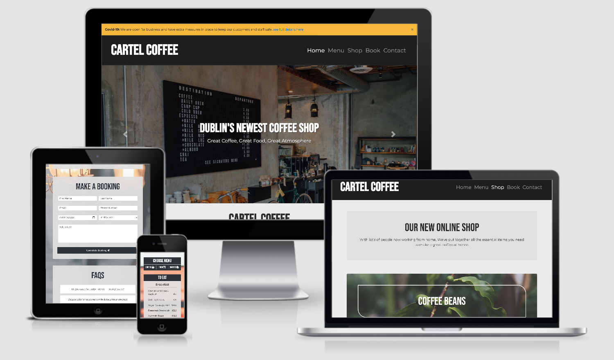
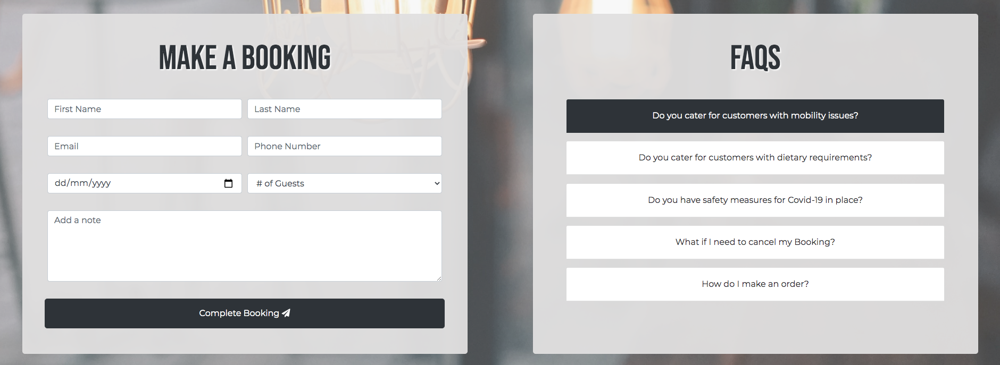
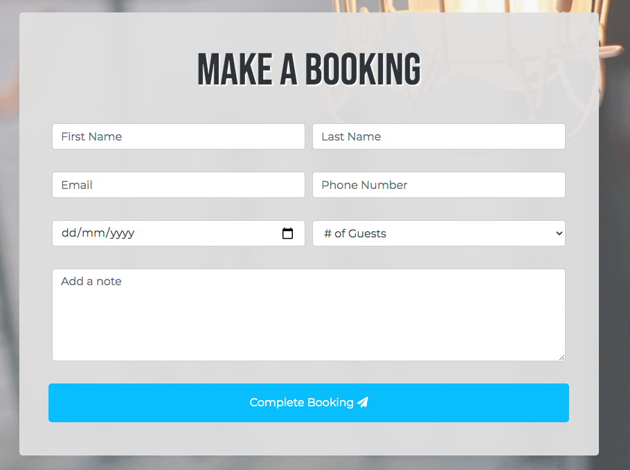
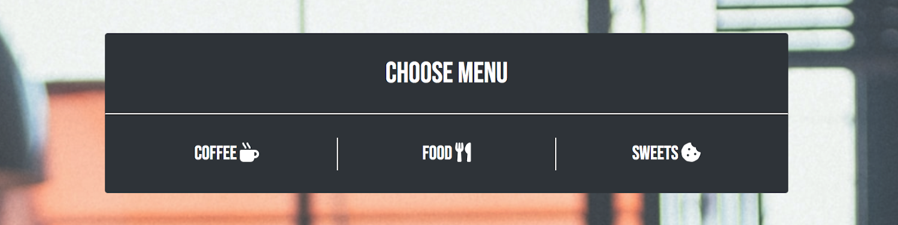

# Cartel Coffee Website Build

[Visit the Deployed Site on github pages](https://nickassafkirk.github.io/Cartel-Coffee/index.html)

---
## Overview

The purpose of this project is to build a mobile responsive website for a new coffee shop in Dublin called Cartel coffee. By creating this site the business wants to increase their online visibility, increase revenue and to attract new customers to their business. They wish to introduce the ability to receive takeaway orders and start selling coffee and associated products online.     
They want to use the site as a platform to update customers on business updates and as a means to continue trading if their restaurant is forced to close during Covid-19 lockdown restrictions.     
The goal of this project is to build a mobile first site which meets the intial business needs while providing an excellent user experience for site users. 

**NB:** *This is a fictional business created for educational purposes only*

---
## UX

The intention of this site is to enable new and existing users, who are searching online, to find cartel coffee and to learn about the business's background, products and services. 

The primary business goal is to convert customers who are landing on the site into physical customers at the business's location. 
To achieve this goal, the site's key focus is to provide the functionality to allow customers to make bookings to dine at the café, to order food for collection and to generate general enquiries from potential customers landing on the site.

The secondary goal of this site is to generate new revenue streams by offering coffee and associated products for sale online, by phone or email and to generate additional takeaway revenues by linking to 3rd party takeaway apps such as deliveroo, just eat, uber eats etc... 

This website is designed to provide 4 distinct functions:
  1. Contact: The site must enable customers to contact the business.
  1. Order: The site must enable customers to order food remotely.
  1. Buy: The site must enable customers to buy products remotely.
  1. Inform: The site must inform customers of key information about the business.

The site must cater to broad range of users. Individual users may be interested in one or more of the 4 site functions in a single session. To aid conversion, emphasis is made to create multiple inter-linking navigation pathways between site pages. This enables users to access the information that is relevant to them, 
while ignoring information that may not be relevant at that moment. 

To provide a great user experience every effort has been made to ensure that information is displayed clearly in a logical order of importance. 

To increase brand awareness and provide a consistent user experience for online and offline customers, the website has been designed to mirror the styling of the business's physical location. 
As this is a fictional business, the images depicted in the homepage carousel have been chosen to reflect the business's theoretical in-store appearance. 

---
## Strategy

### Ideal User
The ideal user for this site is: 
* Age 21-55 with mid to high income.
* Is tech savvy and owns a smart phone, tablet and or computer.
* Has disposable income.
* Lives within a 5km radius of the business.
* Works within a 2km radius of the business.
* A regular coffee drinker.
* A person who enjoys dining out regularly.
* A person who enjoys meeting friends for lunch, dinner, coffee etc...
* A person who brews coffee at home or in the office.
* A person who orders takeaway frequently.

### User Goals
* Users want to know the purpose of the site immediately.
* Users want to learn more about the business.
* Users want to view the business's menus.
* Users want to make orders for takeaway/collection.
* Users want to make reservations.
* User want to view the business's policies.
* Users want to view and buy coffee, equipment and merchandise online.
* Users want to contact the shop for more information.
* Users want to visit the business's social media profiles to learn more about them.

### Business Goals
* The business owner wants to increase their online awareness.
* The business owner wants to interact with new and existing customers online.
* The business owner wants to increase revenues by attracting new customers who are searching for local businesses online.
* The business owner wants to increase their brand awareness by providing background information about the business.
* The business owner wants to prequalify customers and speed up how customers order in store by displaying their menus online.
* The business owner wants to allow takeaway orders by displaying their menu and contact information online.
* The business owner wants to increase takeaway orders by linking to 3rd party delivery applications.
* The business owner wants to receive more reservations by providing customers with their booking policy and contact information online.
* The business owner wants to engage existing customers by displaying new products and menu items.
* The business wants to increase revenues by offering coffee, subscriptions, equipment and merchandise for sale online.
* The business owner wants to increase social media interaction with customers by linking their social media accounts on their website.

### User Stories

1. As a new user I want to see the menu and phone number so I can order food for collection.
1. As a new user I want to fill out a contact form so that I can make a reservation for dinner.
1. As a new user I want to view the business's product range and contact details so I can order products remotely. 
1. As a new user I want to view a gallery of the Cafe and their social media, so I can decide if it is an appropriate environment to hold a business meeting.
1. As a potential customer I want to see the Cafe's location on a map, so I can visit the business premises. 
1. As a potential customer I want to know when the business is open so I can visit during opening times.
1. As a new user I need to be able to navigate between pages so I can view multiple site pages.
1. As a new user I want to trust the business and value their products so I can ensure I am spending my money wisely.
1. As a potential customer I need to know if the business is wheelchair accessible so I can decide if the business is suitable for people with disabilities.

---
## Scope 

### Features to be included in initial iteration
* A prominent logo.
* A naviagtion menu for navigation between pages and distinct page sections.
* The business contact information.
* The business location & map.
* A general contact form.
* A specific booking form.
* The food & drinks menus.
* A link to deliveroo.
* Products & product information and instructions on how to make a purchase.
* The business's social media links.
* A list of commonly asked questions/FAQs.
* A Covid-19 alert.
* A form submission message.
* An about, terms and conditions, Covid-19 and privacy policy placeholder page.

### Features/Functionality to be added
* Functionality to add products to basket to improve the customer shopping experience.
* Functionality to checkout and purchase products online to aid online conversion.
* Functionality to order food online to improve the customer ordering experience.
* Detailed food menu item information - Allow a detailed description of the menu food item on click or hover to improve the customer ordering experience.
* A functioning contact box in contact.html page to forward submitted enquiries and bookings to preferred email address using PHP.
* Detailed  product information - Allow a detailed description of each product on click or hover to improve the user's online shopping experience.
* Individual product pages - A specific detailed .html page with full product information for each product in the shop. To improve online conversion, seo and site traffic. 
* Build out privacy policy & Terms and conditions pages - These footer links are here as placeholders only to display that these are important links to dislay on a consumer facing site. 
  As this is a "fictional business" these are linked to a placeholder page (about.html) but if this were to be used commercially, a detailed privacy policy and Terms & conditions page would be created to build customer confidence and adhere to european regulations. 
* A GDPR compliant cookies policy pop up to comply to EU regulations.
* Add Scroll functionality with wider browser and device support to improve the user experience when navigating to anchor links.
* Add functionality to allow animations to take place before users are redirected to the link destination, in order provide a better 
user experience on touch screen devices where hover is not possible.

---
## Structure

### Pages
#### 1. [Homepage](https://nickassafkirk.github.io/Cartel-Coffee/index.html) 
The Primary landing page for the site which includes the key information on the business and links to additional pages where more detailed information relating to specific business services can be found.

#### 2. [Menu Page](https://nickassafkirk.github.io/Cartel-Coffee/menu.html)
This page describes the cafe's food and drink menu, as this is the business primary function it is imperative to clearly display their menu items so that customers can order remotely or make the decision to dine in-store after seeing and liking the menus. 

#### 3. [Shop Page](https://nickassafkirk.github.io/Cartel-Coffee/shop.html) 
This page displays the customers "take home" product range of coffee, equipment and merchandise. This enables the business to explore additional revenues from existing customers and to reach a new target audience who may not be able to visit their store to buy products, food or drink in-person.

#### 4. [Contact/Book Page](https://nickassafkirk.github.io/Cartel-Coffee/contact.html)
This is the primary contact page, where the business's contact information can be found so that potential customers can contact the business and convert into customers by making bookings, visiting the store, phoning, making email contact etc...

#### 5. [About page](https://nickassafkirk.github.io/Cartel-Coffee/about.html)
This page displays supporting information on the business. It's purpose is to build brand awareness, consumer confidence and trust in the business. As this is a mock business this has been used as a placeholder to state that this project was built for education purposes only. A basic about us section has been included on the homepage for a similar purpose.

#### 6. [Form submission page](https://nickassafkirk.github.io/Cartel-Coffee/submit.html)
A success page loaded upon successful form submission to reassure users their message or booking has been received.

---
### Detailed Features

#### [Homepage](https://nickassafkirk.github.io/Cartel-Coffee/index.html) 
 * Main navigation menu - allows users to navigate between pages and sections of the site by linking relevant pages in the header of each page. Bootstraps navbar collapse is used to create a clean and condensed experiece on smaller screen sizes.
 * Hero image slider - allows users to quickly learn the sites purpose by displaying a preview of the business location and decor and outlines the business's key functions (it's a cafe, they open 7 days and they also sell products) with the use of bold overlying captions. The Carousel slider is used to display multiple images clearly across all device sizes.
 * Welcome text - allows users to quickly learn the sites purpose, in order to build trust in the business and to encourage users to explore more of the site.
 * Menu section - allows users quick access to the restaurants food and beverage menus so they can order food to collect or decide wether to visit the cafe to dine.
 * Shop categories section - allows users to quickly access each individual product category in the online shop so they can access products by their particualr interest.
 * About section -  this section provides more information about the business's background to build trust and rapport with new users.
 * Footer - provides links to popular pages and contact information to allow users to navigate to additional site pages when located at the bottom of the webpage.

#### [Menu Page](https://nickassafkirk.github.io/Cartel-Coffee/menu.html)
 * Navigation - a consistent navigation bar allows users to easily navigate to the different site pages without having to use their browser back/forward buttons.
 * Intro section - this section qualifies this page's purpose and encourages first time learning. It provides tantalizing information about the cafe's menus and encourages users to explore more. 
 * "Choose Menu" Sub navigation bar - Allows quick navigation to specific page sections to allow swift user navigation to their particular area of interest.
 * Food menu section: shows users the company's primary food options to encourage customers to dine at the cafe or order for takeaway/collection.
 * Dessert menu section: Shows users the business's regular dessert options to encourage customers to dine at the cafe or order for takeaway/collection.
 * Coffee menu section: Shows users the business's coffee menu to encourage customers to visit the premises for coffee. 
 * Order Section: The order section is added to implement a means to convert users into takeaway customers at the end of the menu page. Call and deliveroo buttons are utilised
 to allow customers to order via their preferred method. 
 * Footer - provides links to popular pages and the business's contact information. This allows users to navigate to additional site pages when scrolled to the bottom of the page.

#### [Shop Page](https://nickassafkirk.github.io/Cartel-Coffee/shop.html) 
 * Navigation - a consistent navigation bar allows users to easily navigate to the different site pages without having to use their browser back/forward buttons
 * Intro Jumbotron - A brief intro text box explaining the purpose of the page and encouraging first-time learning.
 * Category headings - Relevant products are grouped together by association. Bold headings are utilised to delineate where each section starts and ends and to provide context for each grouping of products.
 * Product tiles - Each product is composed of an Image thumbnail, Product tile, price and buy button. Clear, uniform product structure shows customers the key information needed to inform a purchase. Buy now buttons are currently utilised for display only.
 * Category trust marks - These sections summarise additional information relevant to each product category. They are added to provide additional information to build user trust and to show additional value in order to encourage a purchase.
 * Merchandise Jumbotron - A prominent text box to explain new products are coming soon. This is added to inform customers that the shop is regularly updated with new products to entice customers to return to the site at a later date to make additional purchases.
 * Footer - provides links to popular pages and contact information to allow users to navigate to additional site pages when scrolled to the bottom of the page 

#### [Contact/Book Page](https://nickassafkirk.github.io/Cartel-Coffee/contact.html)
 * Navigation - a consistent navigation bar allows users to easily navigate to the different site pages without having to use their browser back/forward buttons
 * Google maps embedded map - allows users to see store's physical location and clicking the map opens directions to the store in google maps so new users can navigate easily to the cafe. 
 * Contact form - allows customers to make general email enquiries without the need to open another tab or their email application. By entering their name, email address, phone number (optional) and their message users can contact the business with their enquiry. Form validation ensures customers that ther enquiry has been submitted and notifies and prevents submission if a required field has been missed. 
 * Booking form - allows users to book a table at the location to convert users into customers. Form validation ensures bookings are submitted with required information for a quick and easy process for the user and the business.
 * FAQS section - A list of commonly asked questions builds trust with users by allowing users to instantly get answers to commonly asked questions without having to wait for a response by call or email. This increases the chance that users will convert into customers upon their first site visit
 and means staff don't have to reply to commonly asked questions, thus reducing the business's workload.. Bootstrap expand/collapse functionality is used for this section to condense large sections of text into a smaller space for better display on mobile devices. 
 * Footer - provides links to popular pages and contact information to allow users to navigate to additional site pages when scrolled to the bottom of the page 

#### [About page](https://nickassafkirk.github.io/Cartel-Coffee/about.html)
 * Navigation - a consistent navigation bar allows users to easily navigate to the different site pages without having to use their browser back/forward buttons.
 * Info section - The about page on this site is used as a placeholder to state that the intention of this site is purely as an educational project. This page has been used as a link location for these footer items; about, terms & conditions, privacy policy, covid-19 and the covid-a9 alert where the creation of specific pages for these links was outside the scope of this project. 
 * Return home button - This button allows users to quickly return to the site hompeage after reading the information section.
 * Footer - provides links to popular pages and contact information to allow users to navigate to additional site pages when scrolled to the bottom of the page 

#### [Form submission page](https://nickassafkirk.github.io/Cartel-Coffee/submit.html)
 * Navigation - a consistent navigation bar allows users to easily navigate to the different site pages without having to use their browser back/forward buttons.
 * Success message jumbotron - A bold heading states that the users message has been received. This finalizes form validation and ensures user confidence by communciating clearly that they have used the form correctly. 
 * Faq Link - A link to the FAQs section points to some commonly asked questions that may be relevant to the user's message, in case they previously missed it. 
 * Return home button - This button allows users to quickly return to the site hompeage so they can explore more site content.
 * Footer - provides links to popular pages and contact information to allow users to navigate to additional site pages when scrolled to the bottom of the page 

---
## Skeleton

### Navigation

1. **Main Navigation:** A consistent top nav bar is present across all site pages to allow navigation through various pages. 
    
     Bootstrap navbar expand/collapse classes were used to improve user experience on mobile devices.

     The navbar menu items are listed in order of importance. With the business's primary services listed in order of priority from left to right or top to bottom on mobile.
    
    
    
    I chose to align the navbar collapse icon and collapsed to the menu to the right as [research shows](https://www.livescience.com/what-causes-left-handedness.html) that 85% - 90% of users are right handed and right-alignment results in marginally easier use for right-handed users.
    The Active class is used highlight the current page.
    
2. **Footer navigation:** A consistent bottom footer allows users to navigate between additonal site pages and sections to those included in the main navbar located in the page header. This aids navigation to next point of interest once a user has scrolled down the page.
   Many of the footer items link to specific page section IDs, allowing more targetted navigation to specific sections of information on the site. The footer links essentially list the company's key products and services to teach users the scope of the businesses products and services and encourage 
   conversion from user to customer by allowing users to quickly navigate to their area of interest while ignoring information that may be irrelevant or distract.
   Additional links such as the about page, privacy policies and T&Cs have been added to footer as they are important pages to include on the site but do not merit inclusion in main navbar. 

     

3. **Images as links:** Images and Image tiles are used throughout the site to link strong, descriptive visual images to relevant pages. Popular categories and shop categories are represented as image tiles and overlying text, hover functionality and highlighting are strategies used to reinforce that an image is a link. 
    
    

4. **Buttons:** Buttons are used to reinforce form submission or to create a strong emphasis that a link to another page, page section or external site is present. Consistent button coloring is used across site to drive home the functionality of buttons on the site. Clear button labelling is used to 
    encourage first-time learning and correct use of buttons on the site.
    

    **Button Hover:** Hover functionality has been used to highlight clickable links with bright contrasting colors, in order to reinforce interactivity of animation elements and encourage first time learning. 
    On touch devices clickable elements are highlighted to display that a button or link is in use. 

    

5. **IDs as links:** IDs have been used to allow quick navigation to specific points on a single webpage. This is designed to aid conversion by bringing the user directly to their point of interest without the potential to get distracted. 
   The use of Id based navigation also allows more distinct information to be condensed onto a fewer number of pages for a better user experience, a more condensed site and faster page load times. The footer utilises several id's as links to specific sections
   on the menu, shop and contact pages.

6. **Secondary Navigation Bar:** A secondary navigation menu is utilised on the menu page to allow swift navigation to a user's desired menu section. 
    This is particularly useful on mobile devices where a lot content stacks vertically making it necessary for users to have to scroll down throught page content to get to the bottom of the page. 
    The secondary navigation menu uses a page specific color palette to reinforce it's specific association to the menu page. The submenu
    links to specific page section IDs as outlined the the section above. 

    

### Wireframes

[Home page](assets/wireframes/CC_Index.html_Wireframes.pdf)

[Menu page](assets/wireframes/CC_Menu.html_Wireframes.pdf)

[Contact page](assets/wireframes/CC_Contact.html_Wireframes.pdf)

[Shop page](assets/wireframes/CC_Shop.html_Wireframes.pdf)

### Mockups


A responsive view of the site can be found at [this link](http://ami.responsivedesign.is/?url=https%3A%2F%2Fnickassafkirk.github.io%2FCartel-Coffee%2Findex.html#)

---
## Surface

### Fonts
**General**
Sans-serif fonts have been chosen site-wide for a minimilistic style, consistent with the companies interior decor and to improve legibility for site users.
Font-size and line height are adjusted on different device sizes to ensure correct distribution of information and layout across all devices. Adding additional line height and text-padding to clickable links on smaller screenwidths adds additional space between links to 
aid navigation and touch-interaction on touch-screen devices.

**Logo & Title Fonts**
The Bebas Neue font is used for the company logo, carousel image titles and section headings. It was chosed because of it's bold appearance and clear readability. This font has been styled to be uppercase with a heavier font-weight than the body text
to create recognisable branding and obvious visual impact for key site information. 

**Body Fonts**
The Montserrat font was selected for the body text for it's slim, legible and professional appearance. A much lighter font-weight is used to reinforce an overall minimilistic style 
and to create contrast between branding text and headings. 

**Headings**
Headings also utilise the Bebas Neue font to reinforce that section headings denote the start of key sections of information with a higher priority of importance than accompanying body text.

**Additional Fonts**
The Sans-serif font has been chosen as a fallback font if chosen fonts cannot be loaded from external resources.

---

### Colors
Colors are used to increase contrast, visual impact and to improve readability across the site. A grey, blue and white color palette has
been chosen to add a neutral professional and minimalistic site design and to appeal to a broad range of users. Specific section areas are styled with consisted coloring to reinforce the correlation between different areas of relevant content. 
Root variables were used to allow quick design changes to be made. The main colors used on this project are as follows:

**`--custom: #212121;`** This is the primary brand color a dark grey pantone used for the navbar, footer background and homepage section headings. 

**`--tealgrey: #343a40;`** This is the secondary brand color used for page section headings and buttons.  

**`--logo: #333333;`** This is a dark grey color used for the site's body text.  

**`--bg: #eeeeee;`** used for body background, borders and outlines.   

**`--light: #dddddd;`** used for light text where dark backgrounds are used and contrast is needed to aid readability.  

**`--lighttrans: rgba(228, 228, 227, 0.95);`** used as div/container background colors to highlight areas of specific information and to contrast background images and improve readability.   

**`buttonblue: #07c5ff;`** used as primary button background color upon hover or click to encourage click interaction and to indicate link interactivity and successful button submission.  

**`alertorange: #f9c043;`** used as secondary call to action color specifically for alerts. A bright call to action color was used to draw the user's eye to key information. The orange color does not
adhere to the grey, blue, white color motif chosen for the project in order to communicate that the alert information is general information not specifically linked to the current page subject.
    
**rgba values** of `rgba(0,0,0, 0.(n))` were used throughout the site to create text-shadows and image masks promoting better contrast between text and background items
and to create a highlight effect on hover for clickable image tiles to show new users that these are clickable objects.

**`#fff:`** White text has been used for titles and blocks of text where masks and overlays have been utilised where the `--light` color listed above did not provide adequate text and background contrast.

**`#1d1d1d`:** This very dark grey color is used for the coffee menu section background. It was chosen to emulate a coffee pegboard that is popular in many contemporary cafes and specifically the menu
that is depicted in the homepage carousel 1 image. A darker indent style border is used to create a sense of negative relief to further emmulate this pegboard style menu.

**`#007bff`:** A darker browser default blue color has been used for links on the submit.html and about.html pages and the covid-19 alert where the preferred link color `--buttonblue` did not provide adequate contrast against lighter backgrounds. 

### Use of colors:

**Navigation colors:** Dark, muted header and footer colors are used to give a sense of space and contrast to the main and footer navigation. 

**Body colors:** In contrast the body text utilises light, subtle background colors with dark text colors to clearly distinquish the page content from the navigation. 

**Call-to-action colors:** Buttons, Links and alerts utilise really bright vibrant colors to encourage click behaviour and to act as eyecatching visual indicators of primary call-to-action elements.

**Heading colors:** Bold colored headings clearly define where individual sections begin. Boldly colored section background contrasted with light fonts are chosen to clearly define the purpose of each section of information.

**Section Background colors:** Colored sections with muted grey backgrounds are used to clearly distinguish relevant areas of information. This is important as page sections are scaled to width on larger screen-widths to keep information condensed and easily readable.

---

### Icons
Icons are used as metaphors to reinforce meaning of key navigation elements. The paper plane icon is used to reinforce meaning of send/submission buttons, food and drink icons are used on the menu page to 
reinforce the sub-menu navigation buttons and Icons are used for the contact information and social media links to clearly apply meaning to text-heavy page sections like the footer. Icons are also used to reinforce the meaning of short snippets of text in the shop trust mark sections. 

All icons utilised for this project were sourced from [fontawesome.com](https://fontawesome.com/).

---

### Images 
Images are used in several instances on the site to act as strong visual cues and to break-up and add additional context to sections text. 

**Carousel Images:** Eye catching images are used on the homepage carousel to clearly indicate the businesses key activities. These are chosen to encourage users to understand the purpose of the business as soon as they land on the homepage. The carousel images are also chosen to display the business's physical location to show new users what to expect when they visit the store. 

**Homepage Image Tiles:** Appealing images are used as clickable tiles for the menu category navigation links and shop caetgory navigation links on the homepage. These images are included to quickly visually communicate the type of content a user will be brought to when clicking on each image tile. 

**Product images:** Studio images are used to clearly display a products purpose and to encourage users to buy. Clear striking product images are contrasted with plain backgrounds to put the emphasis on the product and to keep user focus on the key information on the page.

**Background-images:** Subtle background images with added opacity are used to give users a greater understanding of the business's style and appearance without drawing away from the key information on each page. These background images and colored divs are also used to break-up large areas of white-space
for a more visually appealing appearance and a more defined flow of information through the page. Background images utilise a relevant subject matter to the page subject to again reinforce the meaning of each page to first time users. 

---

### Animations
Animations and Hover functionality are used to highlight the interactivity of links and buttons encouraging users to use navigation elements. 
Pseudo classes such as hover, focus and active also provide user feedback by highlighting when an element is clickable and by validating when an action has been performed.
In future iterations of this project, I hope to allow animations associated with links to take place before users are redirected to the link destination to provide a better 
user experience on touch screen devices where hover is not possible.

---
## Technologies Used


### HTML5 
[https://www.w3.org/html/](https://www.w3.org/html/) 

Is used to add content, structure and the ability to navigate to the website.


### CSS3
[https://www.w3.org/TR/CSS/](https://www.w3.org/TR/CSS/) 

Is used to add styles, layout, design and interactivity to the page and to increase usability to users across various devices. 


### Bootstrap V4.5.3 
[https://getbootstrap.com/](https://getbootstrap.com/) 

Is used to add structure, layout and mobile first responsive design to the webpages. 


### Gitpod
[https://www.gitpod.io/](https://www.gitpod.io/) 

Is used to write, edit and preview code.


### GitHub 
[https://github.com/](https://github.com/)

Is used to host, share and deploy the project.


### Balsamiq
[https://balsamiq.com/](https://balsamiq.com/)

Is used to create wireframes as visual mockups of the final site design

---

## Testing

The current deployed version of this project has been thoroughly tested to ensure a great user experience on most common device types.
Testing has also confirmed compatibility with all common browsers to accommodate a great user experience and predictable functionality 
for easy as many users as possible. 

The responsive functionality of the site has been tested to work on most common devices with a 320px screen-width and larger. 

The full testing can be found in [the separate testing.md file](testing.md)

---

## Validation: 

### HTML   
All html files were validated using the [W3C markup validation service](https://validator.w3.org/)

**Errors:** 
There were no errors for the deployed version of this project.

**Warnings**
There were no errors for the deployed version of this project.

### CSS

All css files were validating using the [W3C CSS validation service](https://jigsaw.w3.org/css-validator/)


**Errors:** 
No errors were returned for the deployed version of this project.

**Warnings**
33 warning messages were returned during validation of the deployed version of this site. These warnings are due to some specific css features not being supported by the Jigsaw validation service and can therefore be **ignored**.

*Vendor Prefixes*   
23 warning messages are due to the use of vendor prefixes. This is because the vendor prefixes are browser specific properties and are not in the official CSS specification and therefore 
return warnings during validation despite being considered good practice to ensure cross-browser compatibility. 
This issue is outlined in the [following article](https://www.456bereastreet.com/archive/201101/css_validator_to_report_vendor-specific_extensions_as_warnings_not_errors/) 
and in [this stackexchange forum](https://stackoverflow.com/questions/1889724/how-to-validate-vendor-prefixes-in-css-like-webkit-and-moz)
Therefore these warning messages can be ignored. 

*Root Variables*    
10 warning messages are due to the use of root variables used for colors and fonts on the site. These are returning warning messages upon validation 
because root variables are currently not supported by the validation service despite being widely supported across popular browsers. 
This issue has been outlined at [this link](https://github.com/w3c/css-validator/issues/111) and therefore the warnings can be ignored.

---
## Deployment

This project was developed using the Gitpod IDE, committed to git and pushed to GitHub using the terminal within Gitpod and the gitpod extension for chrome. 

---

### Deployment Instructions 
To deploy this page to GitHub Pages from its GitHub repository, the following steps were taken:

1. First log into [GitHub account](https://github.com/nickassafkirk).
1. From the list of oinned repositories on the home screen, select "Cartel-Coffee".
1. From the menu items which includes *Code, Issues, Pull request, Actions, Projects, Wiki, Security, Insights and settings* 
select the **settings** tab.
1. Within the settings section, scroll down to the **GitHub Pages** section.
1. Under **Source** subheading click the drop-down menu labelled "None" and select "Master Branch"
1. Leave the default /Root folder selected and click save.
1. On selecting Master Branch and saving the page is automatically refreshed, the website is now deployed.
1. Return to the settings section and scroll back down to the GitHub Pages section to retrieve the link to the deployed website.
1. (Optional) Add the website link to the repository info box for ease of use. In the sidebar to the right click the cog icon to the right of the about subheading
and paste the website url into the box labelled "website"

---
### Cloning instructions with Gitpod
To clone this project using Gitpod you will need:

A Github account. [Create a Github account here](https://github.com/join)
Use the Chrome browser
Then follow these steps:

1. Install the [Gitpod Browser Extentions for Chrome](https://chrome.google.com/webstore/detail/gitpod-dev-environments-i/dodmmooeoklaejobgleioelladacbeki?hl=en)
2. After installation, restart your browser
3. Log into Gitpod with your github account.
4. Navigate to the [Project GitHub repository](https://github.com/nickassafkirk/Caffeine-Cartel-Coffee-Shop)
5. Click the green "Gitpod" button in the top right corner of the repository
6. This will open a new gitpod workspace with a clone of the repository

---
### Cloning instructions to a local editor
To work on the project code within a local IDE such as VSCode, Pycharm, brackets etc:

1. Go to the Github repository at [this link](https://github.com/nickassafkirk/Cartel-Coffee)
2. Under the repository name, click the code tab from the menu items
3. In the submenu to the right which has the options: go to file, add file and code, select the code option. 
4. In the Clone with HTTPs section, copy the clone URL for the repository.
5. In your local IDE open the terminal.
6. Change the current working directory to the location where you want the cloned directory to be made.
7. In the terminal type git clone, and then paste the URL you copied in Step 3.
   This should follow the format git clone https://github.com/github-username/repository-name.git
8. Press Enter to successfully clone the repository to your local IDE
9. For more information on cloning from github [see this page](https://docs.github.com/en/free-pro-team@latest/github/using-git/which-remote-url-should-i-use)

---
### Forking instructions
To Fork this repository:

1. Go to the [github homepage](https://github.com/).
1. Sign into Github or sign up for a new account.
1. Find the repository you wish to fork. 
(*([For example this project](https://github.com/nickassafkirk/Cartel-Coffee))*
1. On the right hand side of the repository page you will see options to watch, star or fork. Click Fork.
1. This will create a copy of the project in a new repository within your github account.
1. Once the fork has been created in your github account, it can then be cloned to your prefered editor using one of the methods outlined above.
1. After changes have been made locally they can be submitted via pull request for aprroval and inclusion in the original project.

---
## Code 

The code in this project was written by me ([Nick Kirk](https://github.com/nickassafkirk)) the project owner. Any code snippets written by other developers or found from online resources have been credited
in the credits section below.

### Frameworks
**Bootstrap** CDN was used to create a responsive site design. Several bootstrap components were utilised including navbar, jumbotrons, alerts, modals, forms and the collapse functionality. 
Custom CSS was used to apply unique styling to bootstrap components.

---
## Credits

### Content Credits
All text is unique content written by me ([Nick Kirk](https://github.com/nickassafkirk)) the project owner for the purpose of this project. The business described by this project is of fictitious nature and has been fabricated purely for educational purposes.

---
### Code Credits
- To fix issues with footer content alignment I read documentation on flexbox at [This article](https://developer.mozilla.org/en-US/docs/Web/CSS/CSS_Flexible_Box_Layout/Aligning_Items_in_a_Flex_Container)
  I confirmed how to implement flexbox utilities while using Bootstrap by reading the documentation on [this page](https://getbootstrap.com/docs/4.5/utilities/flex/)

- To create a more understandable submenu functionality for the submenu on the menu.html page I used a scroll functionality that I learnt about in [this post](https://stackoverflow.com/questions/24739126/scroll-to-a-specific-element-using-html)
    ```
    html{
        scroll-behavior: smooth;
    }
    ```
    Unfortunately this scroll functionality is not supported by all browsers and devices but as it is supported by most modern browsers it's use was deemed appropriate for this project. It was not within the scope of this project to produce a scroll behaviour by alternative 
    means that is supported by all browsers and devices.

- To vertically center the carousel caption text on the index.html page. I used the transform technique as described in [this forum](https://stackoverflow.com/questions/27279865/how-to-vertically-center-a-bootstrap-carousel-caption)
 from which I utilised this snippet of css:

    ```
        .carousel-caption{
        top: 50%;
        transform: translateY(-50%);
        bottom: initial;
        }

        .carousel-item{
        -webkit-transform-style: preserve-3d;
        -moz-transform-style: preserve-3d;
        transform-style: preserve-3d;
        }
    ```

- As an alternate method to add background opacity to page sections I used a method which utilises pseudo elements that I found published by [Andy Hattemer and Nicholas Cerminara in this article](https://www.digitalocean.com/community/tutorials/how-to-change-a-css-background-images-opacity)
    ```
    /* You could use :after - it doesn't really matter */
    .demo_wrap:before {
        content: ' ';
        display: block;
        position: absolute;
        left: 0;
        top: 0;
        width: 100%;
        height: 100%;
        z-index: 1;
        opacity: 0.6;
        background-image: url('https://assets.digitalocean.com/labs/images/community_bg.png');
        background-repeat: no-repeat;
        background-position: 50% 0;
        background-size: cover;
    }
    ```

- Inspiration for animation used in menu.html subnav was from [this stack overflow discussion](https://stackoverflow.com/questions/42745506/how-to-make-an-icon-spin-with-i-tag-in-html5-through-css3) and general animation info was found at [this page](https://www.w3schools.com/cssref/css3_pr_animation-keyframes.asp)
    ```
        $(document).ready(function() {
            $('.js-spin').click(function() {
            $(this).addClass('icn-spinner') //remove class to stop animation
            });
        });

    i {
    font-size: 40px;
    }

    .icn-spinner {
        animation: spin-animation 0.5s infinite;
        display: inline-block;
    }

    @keyframes spin-animation {
        0% {
            transform: rotate(0deg);
        }
        100% {
            transform: rotate(359deg);
        }
    }
    ```

- To find a way to hide the homepage menu tile headings upon hover, I was inspired by a method described in [this stackoverflow article](https://stackoverflow.com/questions/9913293/change-text-on-hover-then-return-to-the-previous-text/9913526)
    ```
    a:hover span {
    display:none;
    }
    ```
- To enable modals to appear upon page load by default I found a solution at [this article](https://www.tutorialrepublic.com/faq/how-to-launch-bootstrap-modal-on-page-load.php#:~:text=Answer%3A%20Use%20the%20Bootstrap%20.,modal('show')%20method&text=modal('show')%20method%20for%20launching%20the%20modal%20window,to%20subscribe%20the%20website%20newsletter.)
 I edited this simple script 
    ```
    $(document).ready(function(){
        $("#shopmodal").modal('show');
    });
    ```
 
- To apply favourable modal positioning I used a technique described in [this article](https://css-tricks.com/considerations-styling-modal/)
    from which I utilised this snippet of code 
    ```
        .modal {
        position: fixed;
        top: 50%;
        left: 50%;
        transform: translate(-50%, -50%);
        }
    ```

- To change the icon displayed when showing/hiding a bootstrap collapse component I used a technique found in [this article stackexchange forum](https://stackoverflow.com/questions/19024218/bootstrap-3-collapse-change-chevron-icon-on-click)
    
    ```
    HTML:
         <a data-toggle="collapse" href="#collapseExample" aria-expanded="false" aria-controls="collapseExample">
            Open/Close collapse
            <i class="fa fa-chevron-right pull-right"></i>
            <i class="fa fa-chevron-down pull-right"></i>
        </a>

    CSS:
        a[aria-expanded=true] .fa-chevron-right {
        display: none;
        }
        a[aria-expanded=false] .fa-chevron-down {
        display: none;
        }
    ```

- To add a wiggle functionality to the menu pages call Icons/Images, I customised code found at [this codepen demo](https://codepen.io/theDeanH/pen/zBZXLN)
The original is as seen below:

    ```
    p:hover {
    -webkit-animation-name: wiggle;
    -ms-animation-name: wiggle;
    -ms-animation-duration: 1000ms;
    -webkit-animation-duration: 1000ms;
    -webkit-animation-iteration-count: 1;
    -ms-animation-iteration-count: 1;
    -webkit-animation-timing-function: ease-in-out;
    -ms-animation-timing-function: ease-in-out;
    }

    @-webkit-keyframes wiggle {
    0% {-webkit-transform: rotate(10deg);}
    25% {-webkit-transform: rotate(-10deg);}
    50% {-webkit-transform: rotate(20deg);}
    75% {-webkit-transform: rotate(-5deg);}
    100% {-webkit-transform: rotate(0deg);}
    }

    @-ms-keyframes wiggle {
    0% {-ms-transform: rotate(1deg);}
    25% {-ms-transform: rotate(-1deg);}
    50% {-ms-transform: rotate(1.5deg);}
    75% {-ms-transform: rotate(-5deg);}
    100% {-ms-transform: rotate(0deg);}
    }

    @keyframes wiggle {
    0% {transform: rotate(10deg);}
    25% {transform: rotate(-10deg);}
    50% {transform: rotate(20deg);}
    75% {transform: rotate(-5deg);}
    100% {transform: rotate(0deg);}
    }
    ```

---
### README Credits

I'd like to thank A Greaves who's excellent [README example](https://github.com/AJGreaves/portrait-artist/blob/master/TESTING.md) was used as guide in the creation of this README.

The Code institute [Sample README](https://github.com/Code-Institute-Solutions/SampleREADME) was also used as a template for this project
---
### Image Credits:
The photos used in this site were primarily sourced from [Unsplash.com](https://www.unsplash.com) and have been utilised for educational purposes only. 
A full list of images used in this project can be seen below:

[Carousel 1 Image](https://images.unsplash.com/photo-1493857671505-72967e2e2760?ixlib=rb-1.2.1&ixid=eyJhcHBfaWQiOjEyMDd9&auto=format&fit=crop&w=1350&q=80)
Photo by [Roman Bozhko](https://unsplash.com/@romanbozhko?utm_source=unsplash&amp;utm_medium=referral&amp;utm_content=creditCopyText) on [unsplash](https://unsplash.com/s/photos/coffee-shop?utm_source=unsplash&amp;utm_medium=referral&amp;utm_content=creditCopyText)

[Carousel Image 2](https://unsplash.com/photos/qE1jxYXiwOA)
Photo by [Petr Sevcovic](https://unsplash.com/@sevcovic23?utm_source=unsplash&amp;utm_medium=referral&amp;utm_content=creditCopyText) on [unsplash](https://unsplash.com/s/photos/coffee?utm_source=unsplash&amp;utm_medium=referral&amp;utm_content=creditCopyText)

[carousel 3 image](https://unsplash.com/photos/pf70wY3llLg)
Photo by [Kadir Celep](https://unsplash.com/@kadircelep?utm_source=unsplash&amp;utm_medium=referral&amp;utm_content=creditCopyText) on [unsplash](https://unsplash.com/s/photos/coffee-grinder?utm_source=unsplash&amp;utm_medium=referral&amp;utm_content=creditCopyText)

[Espresso Tile](https://unsplash.com/photos/LnG_bBDHLYo)
Photo by [Lodewijk Hertog](https://unsplash.com/@lue101?utm_source=unsplash&amp;utm_medium=referral&amp;utm_content=creditCopyText) on [unsplash](https://unsplash.com/s/photos/espresso?utm_source=unsplash&amp;utm_medium=referral&amp;utm_content=creditCopyText)

[Porridge tile](https://unsplash.com/photos/ZgfMmFGGf-E)
Photo by [Chris Ralston](https://unsplash.com/@thisisralston?utm_source=unsplash&amp;utm_medium=referral&amp;utm_content=creditCopyText0) on [unsplash](https://unsplash.com/s/photos/avocado-toast?utm_source=unsplash&amp;utm_medium=referral&amp;utm_content=creditCopyText)

[Sandwich homepage tile](https://unsplash.com/photos/pLKgCsBOiw4)
Photo by [Eaters Collective](https://unsplash.com/@eaterscollective?utm_source=unsplash&amp;utm_medium=referral&amp;utm_content=creditCopyText) on [unsplash](https://unsplash.com/s/photos/sandwiches?utm_source=unsplash&amp;utm_medium=referral&amp;utm_content=creditCopyText)

[Croissant homepage tile](https://unsplash.com/photos/eAsck4oAguM)
Photo by [Monika Grabkowska](https://unsplash.com/@moniqa?utm_source=unsplash&amp;utm_medium=referral&amp;utm_content=creditCopyText") on [unsplash](https://unsplash.com/s/photos/croissant?utm_source=unsplash&amp;utm_medium=referral&amp;utm_content=creditCopyText)

[Pourover](https://unsplash.com/photos/WWzDPKot6nQ)
Photo by [John Forson](https://unsplash.com/@jonforson?utm_source=unsplash&amp;utm_medium=referral&amp;utm_content=creditCopyText) on [unsplash](https://unsplash.com/s/photos/coffee?utm_source=unsplash&amp;utm_medium=referral&amp;utm_content=creditCopyText)

[Coffee Tile](https://unsplash.com/photos/aQlSRcKHIfA)
Photo by [Silviu Beniamin Tofan](https://unsplash.com/@tofansilviuben?utm_source=unsplash&amp;utm_medium=referral&amp;utm_content=creditCopyText) on [unsplash](https://unsplash.com/s/photos/coffee-package?utm_source=unsplash&amp;utm_medium=referral&amp;utm_content=creditCopyText)

[Merchandise mug](https://unsplash.com/photos/kBJEJqWNtNY)
Photo by [Ryan Riggins](https://unsplash.com/@ryan_riggins?utm_source=unsplash&amp;utm_medium=referral&amp;utm_content=creditCopyText) on [unsplash](https://unsplash.com/s/photos/enamel-mug?utm_source=unsplash&amp;utm_medium=referral&amp;utm_content=creditCopyText)

[menuback](https://unsplash.com/photos/sQopSb2K0CU)
Photo by [Andrew Seaman](https://unsplash.com/@amseaman?utm_source=unsplash&amp;utm_medium=referral&amp;utm_content=creditCopyText) on [unsplash](https://unsplash.com/s/photos/dark-kitchen?utm_source=unsplash&amp;utm_medium=referral&amp;utm_content=creditCopyText)

[Contactback](https://unsplash.com/photos/d5SZqLkpIrY)
Photo by [Tomas Jasovsky](https://unsplash.com/@tomasjasovsky?utm_source=unsplash&amp;utm_medium=referral&amp;utm_content=creditCopyText) on [unsplash](https://unsplash.com/s/photos/cafe?utm_source=unsplash&amp;utm_medium=referral&amp;utm_content=creditCopyText)

[Coffee beans product source image](https://images.unsplash.com/photo-1599639957043-f3aa5c986398?ixlib=rb-1.2.1&ixid=eyJhcHBfaWQiOjEyMDd9&auto=format&fit=crop&w=1279&q=80) 
Photo by [earlybird coffee](https://unsplash.com/@earlybird_coffee?utm_source=unsplash&amp;utm_medium=referral&amp;utm_content=creditCopyText) On [unsplash](https://unsplash.com/?utm_source=unsplash&amp;utm_medium=referral&amp;utm_content=creditCopyText)

[Subscription coffee](https://unsplash.com/photos/_5TmD4zSXS8)
Photo by [Battlecreek Coffee Roasters](https://unsplash.com/@battlecreekcoffeeroasters?utm_source=unsplash&amp;utm_medium=referral&amp;utm_content=creditCopyText) on [unsplash](https://unsplash.com/s/photos/coffee-bag?utm_source=unsplash&amp;utm_medium=referral&amp;utm_content=creditCopyText)

[Subscription coffee](https://unsplash.com/photos/_1wDmr4dtuk)
Photo by [Battlecreek Coffee Roasters](https://unsplash.com/@battlecreekcoffeeroasters?utm_source=unsplash&amp;utm_medium=referral&amp;utm_content=creditCopyText) on [unsplash](https://unsplash.com/s/photos/coffee-bag?utm_source=unsplash&amp;utm_medium=referral&amp;utm_content=creditCopyText)

[Subscription coffee](https://unsplash.com/photos/rsnzc-8dVs0)
Photo by [Battlecreek Coffee Roasters](https://unsplash.com/@battlecreekcoffeeroasters?utm_source=unsplash&amp;utm_medium=referral&amp;utm_content=creditCopyText) on [unsplash](https://unsplash.com/@battlecreekcoffeeroasters?utm_source=unsplash&amp;utm_medium=referral&amp;utm_content=creditCopyText)

[Chemex product Picture](https://store.chemexcoffeemaker.com/media/catalog/product/c/h/chemex-classic-6cup-detail_1.png)
Sourced from[Chemexcoffeemaker.com](https://www.chemexcoffeemaker.com/six-cup-classic-series-coffeemaker.html)

[Hario V60 Dripper Product Picture](https://cdn.shopify.com/s/files/1/0065/2718/9028/products/VDG-01B_8fca3194-807a-4835-8619-c1ffeda11367_900x.jpg?v=1570060789)
Sourced from[hario.co.uk](https://www.hario.co.uk/collections/hario-v60-coffee-drippers/products/hario-v60-glass-coffee-dripper-black-01)

[Aeropress Product Picture](https://aeropress.com/wp-content/uploads/2020/01/AeroPress-Original-red.jpg)
Sourced from[aeropress.com](https://aeropress.com/product/aeropress-coffee-maker/)

[Coffee section heading image](https://unsplash.com/photos/KuGAgQm_Rvs)
Photo by [Max Letek](https://unsplash.com/@blackprojection?utm_source=unsplash&amp;utm_medium=referral&amp;utm_content=creditCopyText) on [unsplash](https://unsplash.com/s/photos/coffee-plant?utm_source=unsplash&amp;utm_medium=referral&amp;utm_content=creditCopyText)

[Subscription section heading image](https://unsplash.com/photos/1Yje-NZrrME)
Photo by [William Moreland](https://unsplash.com/@relentlessjpg?utm_source=unsplash&amp;utm_medium=referral&amp;utm_content=creditCopyText) On [unsplash](https://unsplash.com/?utm_source=unsplash&amp;utm_medium=referral&amp;utm_content=creditCopyText)

[Equipment section heading image](https://unsplash.com/photos/SPhGPOROS4M)
Photo by [Deborah Diem](https://unsplash.com/@debidiemski?utm_source=unsplash&amp;utm_medium=referral&amp;utm_content=creditCopyText) on [unsplash](https://unsplash.com/s/photos/coffee-filter?utm_source=unsplash&amp;utm_medium=referral&amp;utm_content=creditCopyText)

[Merchandise section heading image](https://unsplash.com/photos/wCojY8dZwXU)
Photo by [五玄土 ORIENTO](https://unsplash.com/@oriento?utm_source=unsplash&amp;utm_medium=referral&amp;utm_content=creditCopyText) On [unsplash](https://unsplash.com/collections/9736560/ceramics?utm_source=unsplash&amp;utm_medium=referral&amp;utm_content=creditCopyText)

HTML5 Logo: 
Sourced from [W3.org](https://www.w3.org/html/logo/#downloads)

CSS3 Logo:
Sourced from [wikipedia commons](https://commons.wikimedia.org/wiki/File:CSS3_logo_and_wordmark.svg)

Bootstrap Logo:
Sourced from [Wikipedia](https://en.wikipedia.org/wiki/Bootstrap_(front-end_framework))

Gitpod Logo:
Sourced from [Gitpod](https://www.gitpod.io/media-kit/)

Github Logo:
Sourced from [Github](https://github.com/logos)

Balsamiq Logo:
Sourced from [Balsamiq](https://balsamiq.com/company/brandassets/)

#### Icons:
All icons used on this project were sourced from [Fontawesome](https://fontawesome.com/).

---
## Acknowledgements

I'd like to thank my mentor Nishant Kumar for his help and advice throughout this project. His encouragement and feedback we're invaluable in the completion of this project.

I would also like to thank Jim Morel, Tim Nelson, Stefan, Simen Daehlin and all our other tutors from the code-institute for all their help and advice during our tutor sessions and masterclasses.

