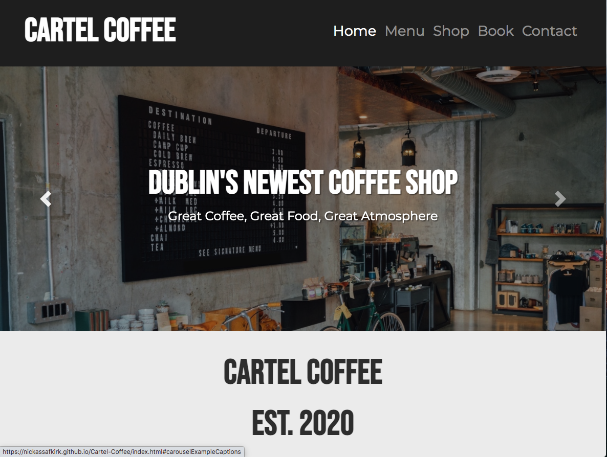
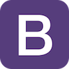

# Cartel Coffee Website Build

[Link to Deployed Site](https://nickassafkirk.github.io/Cartel-Coffee/index.html)
## Overview

The purpose of this project is to build a mobile responsive website for a new coffee shop in Dublin called Cartel coffee. The Business wants to increase their online visibility, increase revenue and to attract new customers. They want to introduce the ability to receive takeaway orders and start selling online. They want to use the site as a platform to update customers on business changes and to continue trading if restaurants are forced to close during Covid-19 restrictions. 
The goal is to build a mobile first site which meets the intial business needs while providing an excellent user experience for site users. 

**NB:** *This is a theoretical business created for educational purposes only*

---

## UX
 
The intention of this site is to allow new and existing users to find the business, learn about the business and to convert into physical customers at the business's location or virtual customers via ordering online, over the phone and by email. 
To provide a great user experience it is important that information is displayed clearly in a logical order of importance. As this website is designed to provide several distinct functions (contact, buy, order and inform), for a broad range of users, emphasis has been made to create multiple interlinking navigation methods so that customers can find and source the information that is relevant to them while ignoring information that may not be relevant at that moment. 
To increase brand awareness and a consistent experience for online and offline customers, the website has been designed to mirror the styling and motif that customers experience while visiting the business's physical location. 
As this is an imagined business the images used in the homepage carousel have been chosen to reflect the business's physical location. 

### Strategy

#### User goals
* Users want to know the purpose of the site immediately.
* Users want to learn more about the business.
* Users want to view the business's menus.
* Users want to make orders for takeaway/collection.
* Users want to view the reservations policy and have the ability to make reservations.
* Users want to shop for coffee, equipment and merchandise online.
* Users want to contact the shop for more information.
* Users want to visit the business's social media profiles to learn more about them.

#### Business Needs
* The business owner wants to increase their online awareness and to interact with new and existing customers online
* The business owner wants to increase revenues by attracting new customers who are searching for local businesses online
* The business owner wants to increase their brand awareness by providing background information about the business and it's staff
* The business owner wants to prequalify customers and speed up how customers order in store by displaying their menus online
* The business owner wants to allow takeaway orders by displaying their menu and contact information online
* The business owner wants to receive more reservations by providing customers with their booking policy and contact information online
* The business owner wants to engage existing customers by displaying their "specials board"
* The business wants to increase revenues by offering coffee, subscriptions, equipment and merchandise for sale online
* The business owner wants to increase social media interaction with customers by linking their social media accounts on their websites

#### User Stories

##### User stories
1. As a new user I want to see the menu and phone number so I can order food for collection.
2. As a new user I want to fill out a contact form so that I can make a reservation for dinner.
3. As a new user I want to view the business's product range and contact details so I can order products remotely. 
4. As a new user I want to view a gallery of the Cafe and their social media, so I can decide if it is an appropriate environment to hold a business meeting.
5. As a new user I want to see the Cafe's location on a map, so I can visit the premises.
6. As a new user I need to be able to navigate between site pages.
7. As a new user I want to trust the business and value their products.

### Scope 

#### Features to be included in initial iteration
* A prominent logo
* A Navbar for navigation amongst pages and sections
* The business contact information
* The Business location & map
* A contact form
* A Booking form
* The Food & Drinks menus
* Products & Product information
* Business social media links
* A list of commonly asked questions/FAQs
* A Covid-19 Alert

#### Features/Functionality to be added
* Functionality to add products to basket
* Functionality to checkout and purchase products online
* Functionality to order food online 
* Detailed food menu item information - Allow a detailed description of the menu food item on click or hover.
* A functioning contact box in contact.html page to link to preffered email address using PHP.
* Detailed  Product information - Allow a detailed description of each product on click or hover.
* Individual product pages - A specific detailed .html page with full product information for each product in the shop.
* Build out privacy policy & Terms and conditions pages - These footer links are here as placeholders only to display that these are important links to dislay on a consumer facing site. 
  As this is a "Mock business" these have been left blank but if this were to be used a detailed privacy policy and Terms & conditions page would be created to build customer confidence and adhere to european regulations. 

### Structure 

* **index.html:** The Primary landing page for the site which includes the key information on the business and links to additional pages where more detailed information can be found.
* **contact.html:** This is the primary contact page, where the business's contact information can be found so that potential customers can contact the business and convert into customers by making bookings, visiting the store, phoning, making email contact etc...
* **menu.html:** This page describes the cafe's food and drink menu, as this is the business primary function it is imperative to clearly display their menu items so that customers can order remotely or make the decision to dine in-store
* **shop.html:** This page displays the customers "take home" product range of coffee, equipments and merchandise. This enables the business to explore additional revenues from existing customers and to reach a new target audience who may not be able to visit their store to shop.
* **about.html:** This page displays supporting information on the business. It's purpose is to build brand awareness, consumer confidence and trust in the business. 

#### Detailed Features

* Homepage
 * Navigation - allows users to navigate between pages and sections of the site by linking relevant pages in the header of each page. Bootstraps navbar collapse is used to create a clean and condensed experiece on smaler screen sizes.
 * hero image slider - allows users to see and access important information at the top of the page. Carousel slider is used to display multiple images clearly accross all device sizes.
 * Welcome text - allows users to quickly learn about the business background to build trust in the business and to encourage them to explore more on the site
 * Menu section - allows users quick access to the restaurants food and beverage menus so they can order food to collect 
 * Shop categories section - allow users to quickly access the primary shop categories in the online shop so they can purchase coffee beans and other items
 * Shop button - gives users a quick way to access the entire shop page in case they do not wish to shop by one of the categories above. By clicking each button they are linked to their elected category on the shop.html page.
 * Footer - provides links to popular pages and contact information to allow users to navigate to additional site pages when scrolling down the page without having to scroll back to the main nav at the top of the page.

* About page
 * Navigation - a consistent navigation bar allows users to easily navigate to the different site pages without having to use their browser back/forward buttons.
 * About intro section - provides background information on the business to build rapport and trust with new users in order to encourage them to make a purchase or to visit the cafe. 
 * meet the team section - introduces the team members to users to build trust and a sense of personality to encourage users to make a booking or purchase.
 * footer - provides links to popular pages and contact information to allow users to navigate to additional site pages when scrolling down the page without having to scroll back to the main nav at the top of the page.

* Contact page/Reservation page
 * Navigation - a consistent navigation bar allows users to easily navigate to the different site pages without having to use their browser back/forward buttons
 * Google maps embedded map - allows users to see stores physical location and click link to open in map application so they can navigate easily to the cafe. 
 * Contact form - allows customers to make general email enquiries without the need to open another tab or their email application. By entering their name, email address, phone number (optional) and their message users can contact the business with their enquiry. From validation ensures customers that ther enquiry has been submitted and notifies and prevents submission if a required field has been missed. 
 * Booking form - allows users to book a table at the location to convert users into customers. 
 * FAQS section - coomonly asked questions builds trust with users by allowing users to instantly get answers to commonly asked questions without having to wait for a response by call or email. This increases the chance that users will convert into customers upon first visit
 and means staff don't have to reply to commonly asked questions. Bootstrap expand/collapse functionality is used for this section to condense large sections of text into a smaller space for better display on mobile devices. 
 * footer - provides links to popular pages and contact information to allow users to navigate to additional site pages when scrolling down the page without having to scroll back to the main nav at the top of the page.

* Menu page
 * Navigation - a consistent navigation bar allows users to easily navigate to the different site pages without having to use their browser back/forward buttons
 * Coffee menu section: Shows users the business regular dessert options to encourage customers to dine at the cafe or order for takeaway/collection.
 * Food menu section: shows users the company's primary food options to encourage customers to dine at the cafe or order for takeaway/collection.
 * Dessert menu section: Shows users the business regular dessert options to encourage customers to dine at the cafe or order for takeaway/collection.
 * Order Button: The contact section is added to implement a call-to-action and means to convert users into customers at the end of the menu page. 
 * footer - provides links to popular pages and contact information to allow users to navigate to additional site pages when scrolling down the page without having to scroll back to the main nav at the top of the page.

* Shop page
 * Navigation - a consistent navigation bar allows users to easily navigate to the different site pages without having to use their browser back/forward buttons
 * Intro Jumbotron - A brief intro text box explaining the purpose of the page and encouraging first-time learning.
 * Category headings - Group relevant products together by association to increase readability sense of purpose for first time users.
 * Product tiles: Border, image thumbnail, tilte, price, buy button. Clear, uniform product structure shows customers the key information needed to inform a purchase.
 * Merchandise Jumbotron - A prominent text box to explain new products are coming soon, to encourage customers to return to the site at a later date.
 * Footer - provides links to popular pages and contact information to allow users to navigate to additional site pages when scrolling down the page without having to scroll back to the main nav at the top of the page.

### Skeleton

1. **Main Navigation:** A consistent top nav bar is present across all site pages to allow navigation through various pages. 
    
     Bootstrap navbar expand/collapse classes were used to improve user experience on mobile devices. 
    
    
    
    I chose to align the navbar collapse icon and collapsed to the menu to the right as [research shows](https://www.livescience.com/what-causes-left-handedness.html) that 85% - 90% of users are right handed and right-alignment results in marginally easier use for right-handed users.
    The Active class is used highlight the current page.
    
2. **Footer navigation:** A consistent bottom footer contains and reinforces importance of main navigation links present in main navbar. This aids navigation to next point of interest once a user has scrolled down the page.
   The footer links listed have been chosen specifically to allow easy navigation to the key pages and page sections.
   Additional links such as the about page, privacy policies and T&Cs have been added to footer as they are important pages to include on the site but do not merit inclusion in main navbar. 

     

3. **Images as links:** Images and Image tiles are used throughout the site to link strong, descriptive visual images to relevant pages. Popular categories and shop categories are represented as image tiles and overlying text, hover functionality and highlighting are strategies used to reinforce that an image is a link. 
    
    

4. **Buttons:** Buttons are used for reinforce form submission or to create a strong emphasis that a link to another page or information is present. Consistent button coloring is used across site to drive home the functionality of buttons on the site. Clear button labelling is used to 
    encourage first-time learning and correct use of buttons on the site.
    

5. **IDs as links:** IDs have been used to allow quick navigation to specific points on a single webpage. This is designed to aid conversion by bringing the user directly to their point of interest without the potential to get distracted. 
   The use of Id based navigation also allows more distinct information to be condensed onto a fewer number of pages for a better user experience, a more condensed site and faster page load times. The footer utilises several id's as links to specific sections
   on the menu, shop and contact pages.

6. **Secondary Navigation Bar:** A secondary navigation menu is utilised on the menu page to allow swift navigation to a user's desired menu section. 
    This is particularly useful on mobile devices where a lot content stacks vertically making it necessary for users to have to scroll down throught page content to get to the bottom of the page. 
    The secondary navigation menu uses a page specific color palette to reinforce it's specific association to the menu page. The submenu
    links to specific page section IDs as outlined the the section above. 

    
#### Wireframes

[Home page](assets/wireframes/CC_Index.html_Wireframes.pdf)

[Menu page](assets/wireframes/CC_Menu.html_Wireframes.pdf)

[Contact page](assets/wireframes/CC_Contact.html_Wireframes.pdf)

[Shop page](assets/wireframes/CC_Shop.html_Wireframes.pdf)

#### Mockups

### Surface

#### Fonts ####
**General**
Sans-serif fonts have been chosen site-wide for a minimilistic style, consistent with the companies interior decor and to improve legibility for site users.
Font-size and line height are adjusted on different device sizes to ensure correct distribution of information and layout across all devices. Altering line height and text-padding on mobile devices 
aids navigation and touch-interaction on touch-screen devices.

**Logo & Title Fonts**
The Bebas Neue font is used for the company logo and the carousel image titles. It was chosed because of it's bold appearance and clear readability. This font has been styled to be uppercase with a heavier font-weight than the body text
to create recognisable branding and obvious visual impact for key site information.

**Body Fonts**
The Montserrat font was selected for the body text for it's slim, legible and professional appearance. A much lighter font-weight is used to reinforce an overall minimilistic style 
and to create contrast between branding text and headings. 

**Headings**
Headings also utilise the Montserrat font but are styled with a heavier font-weight to reinforce a higher priority of importance than accompanying body text.

**Additional Fonts**
The Sans-serif font has been chosen as a fallback font if chosen fonts cannot be loaded. 

#### Colors ####
Colors are used to increase contrast, visual impact, to indicate interactivity of elements and to improve readability across the site. 
Root variables were used to allow quick design changes to be made. The main colors used on this project are as follows:

    logo: #333333; used for body text 
    light: #dddddd; used for light text where dark backgrounds are used
    lighttrans: rgba(228, 228, 227, 0.95); used as div/container background colors for menu and contact pages
    bg: #eeeeee; used for body background, borders and outlines
    buttonblue: #07c5ff; used as primary button background color, link hover color and cta indicator
    alertorange: #f9c043; used as secondary call to action color when button blue clashes with background colors or images.
    custom: #212121; used for navbar and footer background
    tealgrey: #343a40; used for menu.html section headings and buttons. 

    The rgba value of rgba(0,0,0, 0.(x)) was used throughout the site to create text-shadows and image masks promoting better contrast between text and background items
    and to create a highlight effect on hover.

**Navigation colors:** Dark, muted header and footer colors are used to give a sense of space and contrast to the main and footer navigation. 

**Body colors:** In contrast the body text utilises light, subtle background colors with dark text colors to clearly distinquish the page content from the navigation. 

**Call-to-action colors:** Buttons, Links and alerts utilise really bright vibrant colors to encourage click behaviour and to act as eyecatching visual indicators of primary call-to-action elements.

**Heading colors:** Bold colored headings clearly define where individual sections begin. Boldly colored section background colors contrasted with light fonts are chosen to clearly define the purpose of each section of information.

**Section Background colors:** Coloured sections with muted grey backgrounds are used to clearly distinguish relevant areas of information. This is important as page sections are scaled to width on larger screen-widths to keep information condensed and easily readable.

#### Icons ####
Icons are used as metaphors to reinforce meaning of key navigation elements. The paper plane icon is used to reinforce meaning of send/submission buttons, food and drink icons are used on the menu page to 
reinforce the sub-menu navigation buttons and Icons are used for the contact information and social media links to clearly apply meaning to text-heavy page sections like the footer.

#### Images 
Images are used in several ways on the site. 

**Carousel Images:** Eye catching images are used on the homepage carousel to clearly indicate the businesses key activities. These are chosen to encourage users to understand the purpose of the business as soon as they land on the homepage.

**Homepage Image Tiles:** Appealing images are used as clickable tiles for the menus navigation links and shop navigation links on the homepage to quickly visually communicate the type of content a user will be brought to when clicking on each image tile. 

**Product images:** Studio images are used to clearly display a products purpose and to encourage users to buy. Clear striking product images are contrasted with plain backgrounds to put the emphasis on the product and to keep user focus on the key information on the page.

**Background-images:** Subtle background images with added opacity are used to give users a greater understanding of the business's style and appearance without drawing away from the key information on each page. These background images and colored divs are also used to break-up large areas of white-space
for a more visually appealing appearance and a more defined flow of information through the page. 

#### Animations ####
Animations and Hover functionality are used to highlight the interactivity of links and buttons encouraging users to use navigation elements. 
Pseudo classes and active classes also validate when an action has been performed. 

---

## Technologies Used

### HTML5 
[https://www.w3.org/html/](https://www.w3.org/html/) 

Is used to add content, structure and the ability to navigate to the website.

### CSS3
[https://www.w3.org/TR/CSS/](https://www.w3.org/TR/CSS/) 

Is used to add styles, layout, design and interactivity to the page and to increase usability to users across various devices. 

### Bootstrap V4.5.3 
[https://getbootstrap.com/](https://getbootstrap.com/) 

Is used to add structure, layout and mobile first responsive design to the webpages. 

### Gitpod
[https://www.gitpod.io/](https://www.gitpod.io/) 

Is used to write, edit and preview code.

### GitHub 
[https://github.com/](https://github.com/)

Is used to host, share and deploy the project.

### Balsamiq
[https://balsamiq.com/](https://balsamiq.com/)

Is used to create wireframes as visual mockups of the final site design

---

## Code 

## Testing

The current deployed version of this project has been thoroughly tested to ensure a great user experience on most common device types 
and to ensure cross-browser compatibility to ensure easy of use for as many users as possible. 

The full testing can be found in [the sepparate testing.md file](testing.md)

Validation: 

**HTML**
All html files were validated using the [W3C markup validation service](https://validator.w3.org/)

There were no errors or warning messages for the deployed version of this project for any of the pages.

**CSS3**

All css files were validating using the [W3C CSS validation service](https://jigsaw.w3.org/css-validator/)

No errors were returned, however 29 warning messages were returned due to some specific css features not being supported by the Jigsaw validation service. 

21 warning messages are due to the use of vendor prefixes. This is because the vendor prefixes are browser specific properties and are not in the official CSS specification and therefore 
return warnings during validation despite being considered good practice to ensure cross-browser compatibility. 
This issue is outlined in the [following article](https://www.456bereastreet.com/archive/201101/css_validator_to_report_vendor-specific_extensions_as_warnings_not_errors/) 
and in [this stackexchange forum](https://stackoverflow.com/questions/1889724/how-to-validate-vendor-prefixes-in-css-like-webkit-and-moz)
Therefore these warning messages can be ignored. 

8 warning messages are due to the use of root variables used for colors on the site. These are returning warning messages upon validation 
because root variables are currently not supported by the validation service despite being widely supported across popular browsers. 
This issue has been outlined at [this link](https://github.com/w3c/css-validator/issues/111) and therefore the warnings can be ignored.

## Deployment

This project was developed using the Gitpod IDE, committed to git and pushed to GitHub using the terminal within Gitpod nad the gitpod extension for chrome. 

To deploy this page to GitHub Pages from its GitHub repository, the process is as follows:

1. First log into GitHub.
2. From the list of repositories on the screen, select Cartel-Coffee
3. From the menu items which includes *Code, Issues, Pull request, Actions, Projects, Wiki, Security, Insights* 
select the settings tab
4. Within the settings section, scroll down to the **GitHub Pages** section.
5. Under Source click the drop-down menu labelled "None" and select "Master Branch"
6. On selecting Master Branch the page is automatically refreshed, the website is now deployed.
7. Scroll back down to the GitHub Pages section to retrieve the link to the deployed website.
8. (Optional) Add the website link to the repository info box for ease of use. In the sidebar to the right click the cog icon to the right of the about subheading
and paste the website url into the box labelled "website"

To clone this project using Gitpod you will need:

A Github account. [Create a Github account here](https://github.com/join)
Use the Chrome browser
Then follow these steps:

1. Install the [Gitpod Browser Extentions for Chrome](https://chrome.google.com/webstore/detail/gitpod-dev-environments-i/dodmmooeoklaejobgleioelladacbeki?hl=en)
2. After installation, restart your browser
3. Log into Gitpod with your github account.
4. Navigate to the Project GitHub repository
5. Click the green "Gitpod" button in the top right corner of the repository
6. This will open a new gitpod workspace with a clone of the repository

To work on the project code within a local IDE such as VSCode, Pycharm, brackets etc:

1. Go to the Github repository at [this link](https://github.com/nickassafkirk/Cartel-Coffee)
2. Under the repository name, click the code tab from the menu items
3. In the submenu to the right which has the options: go to file, add file and code, select the code option. 
4. In the Clone with HTTPs section, copy the clone URL for the repository.
5. In your local IDE open the terminal.
6. Change the current working directory to the location where you want the cloned directory to be made.
7. In the terminal type git clone, and then paste the URL you copied in Step 3.
   This should follow the format git clone https://github.com/github-username/repository-name.git
8. Press Enter to successfully clone the repository to your local IDE
9. For more information on cloning from github [see this page](https://docs.github.com/en/free-pro-team@latest/github/using-git/which-remote-url-should-i-use)

To Fork this repository:

Enter "Github" into browser and arrive at main Github page.
Sign into Github or sign up.
Find the repository you wish to fork.
On the right hand side of the repository page you will see options to watch, star or fork. Click Fork.
This will create a copy in your new repository which can be edited. After changes have been made you can select a new pull request located in the original repository just above the file listing.

To clone this repository
Enter "Github" into browser and arrive at main Github page.
Sign into Github or sign up.
Find the repository you wish to clone or download.
Find the "clone or download" button just under the repository name.
To clone the repository using HTTPS click the link under "Clone with HTTPS".
Open a terminal and change the current working directory to the location where you want the cloned version of the directory to be copied to.
Type "git clone" and paste the HTTPS code you copied.
Press "enter" to finish creating your clone.

### Code 

**Bootstrap** CDN was used to create a responsive site design. Several bootstrap components were utilised including navbar, jumbotrons, alerts, modals, forms and the collapse functionality. 
custom CSS was used to apply unique styling to bootstrap components.

#### Credits
- To fix issues with footer content alignment I read documentation on flexbox at [This article](https://developer.mozilla.org/en-US/docs/Web/CSS/CSS_Flexible_Box_Layout/Aligning_Items_in_a_Flex_Container)
  I confirmed how to implement flexbox utilities while using Bootstrap by reading the documentation on [this page](https://getbootstrap.com/docs/4.5/utilities/flex/)

- To create a more understandable submenu functionality for the submenu on the menu.html page I used a scroll functionality that I learnt about in [this post](https://stackoverflow.com/questions/24739126/scroll-to-a-specific-element-using-html)

- To vertically center the carousel caption text on the index.html page. I used the transform technique as described in [this forum](https://stackoverflow.com/questions/27279865/how-to-vertically-center-a-bootstrap-carousel-caption)
 from which I utilised this snippet of css:

        .carousel-caption{
        top: 50%;
        transform: translateY(-50%);
        bottom: initial;
        }

        .carousel-item{
        -webkit-transform-style: preserve-3d;
        -moz-transform-style: preserve-3d;
        transform-style: preserve-3d;
        }

- As an alternate method to add background opacity I used a method I found published by [Andy Hattemer and Nicholas Cerminara](https://www.digitalocean.com/community/tutorials/how-to-change-a-css-background-images-opacity)

- Inspiration for animation used in menu.html subnav was from [this stack overflow discussion](https://stackoverflow.com/questions/42745506/how-to-make-an-icon-spin-with-i-tag-in-html5-through-css3) and general animation info was found at [this page](https://www.w3schools.com/cssref/css3_pr_animation-keyframes.asp)

- To find a way to hide the homepage menu tile headings, I was inspired by a method described in [this stackoverflow article](https://stackoverflow.com/questions/9913293/change-text-on-hover-then-return-to-the-previous-text/9913526)

- To enable modals to appear upon page load by default I found a solution at [this article](https://www.tutorialrepublic.com/faq/how-to-launch-bootstrap-modal-on-page-load.php#:~:text=Answer%3A%20Use%20the%20Bootstrap%20.,modal('show')%20method&text=modal('show')%20method%20for%20launching%20the%20modal%20window,to%20subscribe%20the%20website%20newsletter.)
 I edited this simple script 
 
- To apply favourable modal positioning I used a technique described in [this article](https://css-tricks.com/considerations-styling-modal/)
    from which I utilised this snippet of code 
    
        .modal {
        position: fixed;
        top: 50%;
        left: 50%;
        transform: translate(-50%, -50%);
        }

All other code was written by me the project owner.

### Media

#### Icons:
All icons used on this project were sourced from [Fontawesome](https://fontawesome.com/)

#### Images:
The photos used in this site were primarily sourced from [Unsplash.com](https://www.unsplash.com)

[Carousel 1 Image](https://images.unsplash.com/photo-1493857671505-72967e2e2760?ixlib=rb-1.2.1&ixid=eyJhcHBfaWQiOjEyMDd9&auto=format&fit=crop&w=1350&q=80)
Photo by [Roman Bozhko](https://unsplash.com/@romanbozhko?utm_source=unsplash&amp;utm_medium=referral&amp;utm_content=creditCopyText) on [unsplash](https://unsplash.com/s/photos/coffee-shop?utm_source=unsplash&amp;utm_medium=referral&amp;utm_content=creditCopyText)

[Carousel Image 2](https://unsplash.com/photos/qE1jxYXiwOA)
Photo by [Petr Sevcovic](https://unsplash.com/@sevcovic23?utm_source=unsplash&amp;utm_medium=referral&amp;utm_content=creditCopyText) on [unsplash](https://unsplash.com/s/photos/coffee?utm_source=unsplash&amp;utm_medium=referral&amp;utm_content=creditCopyText)

[carousel 3 image](https://unsplash.com/photos/pf70wY3llLg)
Photo by [Kadir Celep](https://unsplash.com/@kadircelep?utm_source=unsplash&amp;utm_medium=referral&amp;utm_content=creditCopyText) on [unsplash](https://unsplash.com/s/photos/coffee-grinder?utm_source=unsplash&amp;utm_medium=referral&amp;utm_content=creditCopyText)

[Espresso Tile](https://unsplash.com/photos/LnG_bBDHLYo)
Photo by [Lodewijk Hertog](https://unsplash.com/@lue101?utm_source=unsplash&amp;utm_medium=referral&amp;utm_content=creditCopyText) on [unsplash](https://unsplash.com/s/photos/espresso?utm_source=unsplash&amp;utm_medium=referral&amp;utm_content=creditCopyText)

[Porridge tile](https://unsplash.com/photos/ZgfMmFGGf-E)
Photo by [Chris Ralston](https://unsplash.com/@thisisralston?utm_source=unsplash&amp;utm_medium=referral&amp;utm_content=creditCopyText0) on [unsplash](https://unsplash.com/s/photos/avocado-toast?utm_source=unsplash&amp;utm_medium=referral&amp;utm_content=creditCopyText)

[Sandwich homepage tile](https://unsplash.com/photos/pLKgCsBOiw4)
[Photo by Eaters Collective](https://unsplash.com/@eaterscollective?utm_source=unsplash&amp;utm_medium=referral&amp;utm_content=creditCopyText) on [unsplash](https://unsplash.com/s/photos/sandwiches?utm_source=unsplash&amp;utm_medium=referral&amp;utm_content=creditCopyText)

[Croissant homepage tile](https://unsplash.com/photos/eAsck4oAguM)
[Photo by Monika Grabkowska](https://unsplash.com/@moniqa?utm_source=unsplash&amp;utm_medium=referral&amp;utm_content=creditCopyText") on [unsplash](https://unsplash.com/s/photos/croissant?utm_source=unsplash&amp;utm_medium=referral&amp;utm_content=creditCopyText)

[Pourover](https://unsplash.com/photos/WWzDPKot6nQ)
Photo by [John Forson](https://unsplash.com/@jonforson?utm_source=unsplash&amp;utm_medium=referral&amp;utm_content=creditCopyText) on [unsplash](https://unsplash.com/s/photos/coffee?utm_source=unsplash&amp;utm_medium=referral&amp;utm_content=creditCopyText)

[Coffee Tile](https://unsplash.com/photos/aQlSRcKHIfA)
Photo by [Silviu Beniamin Tofan](https://unsplash.com/@tofansilviuben?utm_source=unsplash&amp;utm_medium=referral&amp;utm_content=creditCopyText) on [unsplash](https://unsplash.com/s/photos/coffee-package?utm_source=unsplash&amp;utm_medium=referral&amp;utm_content=creditCopyText)

[Merchandise mug](https://unsplash.com/photos/kBJEJqWNtNY)
Photo by [Ryan Riggins](https://unsplash.com/@ryan_riggins?utm_source=unsplash&amp;utm_medium=referral&amp;utm_content=creditCopyText) on [unsplash](https://unsplash.com/s/photos/enamel-mug?utm_source=unsplash&amp;utm_medium=referral&amp;utm_content=creditCopyText)

[menuback](https://unsplash.com/photos/sQopSb2K0CU)
Photo by [Andrew Seaman](https://unsplash.com/@amseaman?utm_source=unsplash&amp;utm_medium=referral&amp;utm_content=creditCopyText) on [unsplash](https://unsplash.com/s/photos/dark-kitchen?utm_source=unsplash&amp;utm_medium=referral&amp;utm_content=creditCopyText)

[Contactback](https://unsplash.com/photos/d5SZqLkpIrY)
Photo by [Tomas Jasovsky](https://unsplash.com/@tomasjasovsky?utm_source=unsplash&amp;utm_medium=referral&amp;utm_content=creditCopyText) on [unsplash](https://unsplash.com/s/photos/cafe?utm_source=unsplash&amp;utm_medium=referral&amp;utm_content=creditCopyText)

[Coffee beans product source image](https://images.unsplash.com/photo-1599639957043-f3aa5c986398?ixlib=rb-1.2.1&ixid=eyJhcHBfaWQiOjEyMDd9&auto=format&fit=crop&w=1279&q=80) 
Photo by [earlybird coffee](https://unsplash.com/@earlybird_coffee?utm_source=unsplash&amp;utm_medium=referral&amp;utm_content=creditCopyText) On [unsplash](https://unsplash.com/?utm_source=unsplash&amp;utm_medium=referral&amp;utm_content=creditCopyText)

[Subscription coffee](https://unsplash.com/photos/_5TmD4zSXS8)
Photo by [Battlecreek Coffee Roasters](https://unsplash.com/@battlecreekcoffeeroasters?utm_source=unsplash&amp;utm_medium=referral&amp;utm_content=creditCopyText) on [unsplash](https://unsplash.com/s/photos/coffee-bag?utm_source=unsplash&amp;utm_medium=referral&amp;utm_content=creditCopyText)

[Subscription coffee](https://unsplash.com/photos/_1wDmr4dtuk)
Photo by [Battlecreek Coffee Roasters](https://unsplash.com/@battlecreekcoffeeroasters?utm_source=unsplash&amp;utm_medium=referral&amp;utm_content=creditCopyText) on [unsplash](https://unsplash.com/s/photos/coffee-bag?utm_source=unsplash&amp;utm_medium=referral&amp;utm_content=creditCopyText)

[Subscription coffee](https://unsplash.com/photos/MvOb1hRy_0M)
Photo by [Battlecreek Coffee Roasters](https://unsplash.com/@battlecreekcoffeeroasters?utm_source=unsplash&amp;utm_medium=referral&amp;utm_content=creditCopyText) on [unsplash](https://unsplash.com/@battlecreekcoffeeroasters?utm_source=unsplash&amp;utm_medium=referral&amp;utm_content=creditCopyText)

[Chemex product Picture](https://store.chemexcoffeemaker.com/media/catalog/product/c/h/chemex-classic-6cup-detail_1.png)
Sourced from[Chemexcoffeemaker.com](https://www.chemexcoffeemaker.com/six-cup-classic-series-coffeemaker.html)

[Hario V60 Dripper Product Picture](https://cdn.shopify.com/s/files/1/0065/2718/9028/products/VDG-01B_8fca3194-807a-4835-8619-c1ffeda11367_900x.jpg?v=1570060789)
Sourced from[hario.co.uk](https://www.hario.co.uk/collections/hario-v60-coffee-drippers/products/hario-v60-glass-coffee-dripper-black-01)

[Aeropress Product Picture](https://aeropress.com/wp-content/uploads/2020/01/AeroPress-Original-red.jpg)
Sourced from[aeropress.com](https://aeropress.com/product/aeropress-coffee-maker/)

HTML5 Logo: 
[W3.org](https://www.w3.org/html/logo/#downloads)

CSS3 Logo:
[wikipedia commons](https://commons.wikimedia.org/wiki/File:CSS3_logo_and_wordmark.svg)

Bootstrap Logo:
[Wikipedia](https://en.wikipedia.org/wiki/Bootstrap_(front-end_framework))

Gitpod Logo:
[Gitpod](https://www.gitpod.io/media-kit/)

Github Logo:
[Github](https://github.com/logos)

Balsamiq Logo:
[Balsamiq](https://balsamiq.com/company/brandassets/)

### Acknowledgements

I'd like to thank my mentor Nisam Kumar for his help and advice throughout this project. His encouragement and feedback we're invaluable in the completion of this project.

I would also like to thank Jim Morel, Tim Nelson, Stefan and Simen Daehlin from the code-institute for all their help and advice during our tutor sessions and masterclasses.

