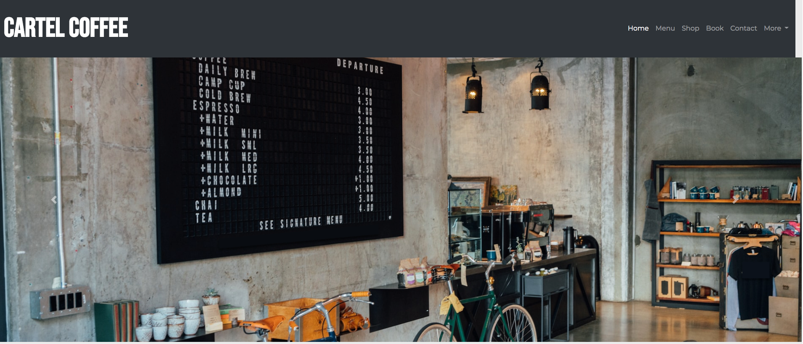
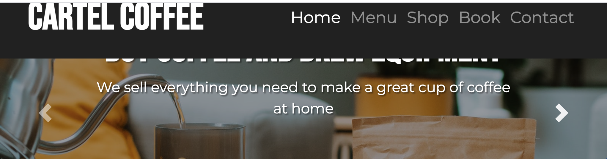
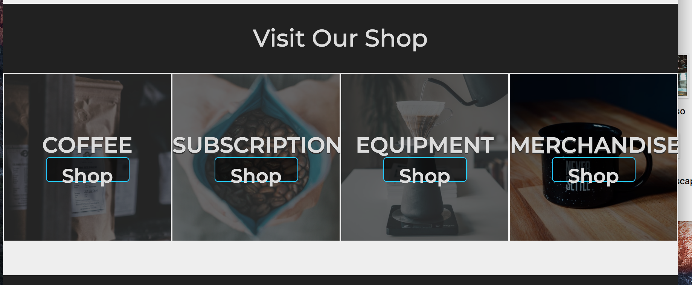

# Cartel Coffee Website - Testing

[Link to README.md file](README.md)

[Link to Deployed site](https://nickassafkirk.github.io/Cartel-Coffee/index.html)

---

## Validation: 

### HTML   
All html files were validated using the [W3C markup validation service](https://validator.w3.org/). 
All html files passed validation.

**Errors:** 
There were no errors for the deployed version of this project.

**Warnings**
There were no warnings for the deployed version of this project.

### CSS

All css files were validating using the [W3C CSS validation service](https://jigsaw.w3.org/css-validator/)

**Errors:** 
No errors were returned for the deployed version of this project.

**Warnings**
33 warning messages were returned during validation of the deployed version of this site. These warnings are due to some specific css features not being supported by the Jigsaw validation service and can therefore be **ignored**.

*Vendor Prefixes*   
23 warning messages are due to the use of vendor prefixes. This is because the vendor prefixes are browser specific properties and are not in the official CSS specification and therefore 
return warnings during validation despite being considered good practice to ensure cross-browser compatibility. 
This issue is outlined in the [following article](https://www.456bereastreet.com/archive/201101/css_validator_to_report_vendor-specific_extensions_as_warnings_not_errors/) 
and in [this stackexchange forum](https://stackoverflow.com/questions/1889724/how-to-validate-vendor-prefixes-in-css-like-webkit-and-moz)
Therefore these warning messages can be ignored. 

*Root Variables*    
10 warning messages are due to the use of root variables used for colors and fonts on the site. These are returning warning messages upon validation 
because root variables are currently not supported by the validation service despite being widely supported across popular browsers. 
This issue has been outlined at [this link](https://github.com/w3c/css-validator/issues/111) and therefore the warnings can be ignored.

---

## User Story Testing

### User stories
1. As a new user I want to see the menu and phone number so I can order food for collection.    
   
   **To Test:**  From homepage a new user can click the menu link in the navbar from all pages. A new user can access the menu page from the popular menu tiles on the site homepage. A user can easily access the menu page from the site footer on all pages.
   Once on the menu page a user can clearly see the menu options and pricing in order to choose what they would like to order. Upon scrolling down the customer is provided with clear instructions on how to order. They can call to order via the call button or copy the phone number from the footer.   
   
   **Result:** The site features and functionality satisfy the needs outlined in the user story.

1. As a new user I want to fill out a contact form so that I can make a reservation for dinner.      
    
    **To Test:**  A clearly labelled "contact" page is accessible in the navbar from all pages. A clearly labelled "Book" link is accessible in the navbar accessible from all pages. A "make a booking" link is located in the footer which is accessible from all site pages. When accessing the contact page the make a booking section is clearly labelled.
    When accessing the contact page by clicking the "Book" navbar menu option or the "make a booking" footer link, the user is scrolled directly to the booking form. 
    The booking form is clearly labelled and provides helper messages if information is entered correctly or if mandatory information is missed or entered incorrectly.
    The form provides a positive submission message upon successful submission of the form, giving the customer feedback that their request has been received and explaining the next steps. 
    
    **Result:** The site features and functionality satisfy the needs outlined in the user story.

1. As a new user I want to view the business's product range and contact details so I can order products remotely.   
    
    **To Test:** A new user landing on the site homepage can access the shop page from the clearly labelled shop heading in the main navbar. A user can navigate to specific product categories via the clearly labelled product category tiles on the site homepage. 
    A user can navigate to the shop page via one of the 4 shop category links located in the footer. Once on the shop page a modal appears notifying customers to call to order. 
    The company's phone number is clearly displayed in the modal. On the shop page key product information is displayed required to make a purchase. Trust marks are added to display additional shipping and returns information. 
    As directed by the modal the customer must call to place an order. The company's phone number is retrievable in the footer accessible from all site pages or clearly labelled on the contact page which accessible from the main navbar.
    
    **Result:** The site features and functionality satisfy the needs outlined in the user story. The ability to checkout and order online would increase conversion and ease of use for the customer but was not within the scope of this project to achieve.

1. As a new user I want to view a gallery of the Cafe and their social media, so I that can decide if it is an appropriate environment to hold a business meeting.   
   
   **To Test:** A new user landing on the homepage is first shown the main carousel at the top of the page. The first two carousel slides depict the business's physical location with ample seating and space. This shows the customer if the location will be appropriate for their needs. 
   Social media links can be found clearly displayed in the site footer, which is accessible from each page. From social media the user can see more images of the business's location, products, menu and more. 
   
   **Result:** The site features satisfy the needs outlined in the user story. Improvements could be made by adding a dedicated gallery page to the site or by adding an instagram feed embed. 

1. As a potential customer I want to see the Cafe's location on a map, so I know where to find the business.    
    
    **To Test:** A new customer landing on the homepage can access the company's address by navigating to the contact page, which is clearly labelled in the main navbar. A user can get the business's location in the footer which is accessible from every site page. 
    Clicking the contact page or the footer address links the user to the site's contact page. Here the first page section is a clearly labelled Find us section with a large embedded map link. The company's full address is also listed clearly for manual entry into maps, sat nav etc.. 
    Clicking the map pin will open google maps in a new tab where the user can get directions to visit the cafe.    
    
    **Result:** The site features satisfy the needs outlined in the user story.

1. As a potential customer I want to know when the business is open so I can visit the business.    
    
    **To Test:** A new user landing on any page can access the contact page from the main navigation menu. A user can also visit the contact page by clicking the find us footer link.
    On the contact page the cafe's opening hours are clearly listed in the first page section. A customer can also see the business address and location on a map in the same page section, should they choose to visit the cafe.  
    
    **Result:** The site features satisfy the needs outlined in the user story.

1. As a new user I need to be able to navigate between site pages so I can view multiple site pages.    
    
    **To Test:** A new user landing on any page can navigate between the different site pages by clicking the prominent navigation menu items at the top of every page. A user can also navigate to more specific page locations by using the detailed
    page section links present in the site footer, which is present at the bottom of each site page.     
    
    **Result:** The site navigation satisfies the user's needs from this user story.

1. As a new user I want to trust the business and value their products so I can ensure I am spending my money wisely.   
    
    **To Test:**  From the  homepage a user can view the business's about information which qualifies the business. An address and contact details in the footer show that the business has a physical location and can be contacted. The about page, Terms and conditions ans privacy policy 
    show that the business has a professional approach and build trust with the user. By navigating to the shop page a user can see the product range offered by the business. Descriptive images, clear titles and prices display the products quality and value. Trust marks in each product section 
    add additional value to the products with free shipping returns etc... All of these factors show new users that the business can be trusted and that their products are of adequate quality and value.  
    
    **Result:** The site features satisfy the needs outlined in the user story.

1. As a potential customer I need to know if the business is wheelchair accessible so I can decide if the business is suitable for people with disabilities.    
    
    **To Test:** A new user can access the business's contact details from the footer of every page. A user can contact the business by phone or email to enquire if the business premises is wheelchair accessible.
    Alternatively a user can access the contact page from the navbar or footer of any page on the site. Once on the contact page a user can make an enquiry or call the business via the contact form or phone number. Alternatively a user can scroll to the FAQ section
    where the first FAQ heading is clearly regarding accessibility for customer with additional needs. Finally a user may access the FAQs section via the link in the footer which is accessible from every page. 
    
    **Result:** The site features satisfy the needs outlined in the user story.

---

## Manual Testing

Manual testing involved going through the site thoroughly to ensure that the format, layout, styles and functionality of the site perform as intended. 
Testing involved: 
1. Testing the site using multiple browsers to ensure cross-browser compatibility.
   The following browsers were tested for the current deployed version of this site:

   | Browser       | Compatible |
   | --------------|------------|
   | Chrome        |   &#9745;  |
   | Safari        |   &#9745;  |
   | Firefox       |   &#9745;  |
   | Opera         |   &#9745;  |
   | Microsoft Edge|   &#9745;  |

1. Testing the site across a range of devices to ensure a responsive site that provides a great user experience on all devices.
   The site was tested on: 

   | IOS           | Windows/Android         |
   |---------------|-------------------------|
   |Macbook Pro 13"| Hp Pavillion 22"        |
   |Iphone 5s      | Samsung a51             |
   |Iphone 6s Plus | Samsung a50             |
   |Iphone SE      | Xiaomi Redmi note 9 Pro |
   |Iphone XS      |
   |Ipad Mini      |
   
1. Testing the site using chrome dev tools to confirm desired functionality across all breakpoints and screen-widths. 

1. Additional testing was carried out by asking friends and family to test the site and to provide feedback on a range of devices. 
    From which a number of spelling areas were corrected and stylistic changes were made.

---
  
## Common Elements:

### 1: Navbar 
* **Aim:** The Navbar is expected to be located full-width at the top of all pages. Navbar logo and links should scale to fit larger/smaller screen-widths and 
avoid overflow. The Navbar should expand/collapse at set breakpoint.    
* **Test:** The browser window was expanded and collapsed to ensure navbar occupies full screenwidth on all screenwidths and to ensure that the navbar expands and collapses at the correct breakpoint. I visually confirmed that header fonts scale to avoid overflow on different screensizes. 
* **Result:** Navbar functions as intended across all screensizes. 

 ### Navbar Logo:
 * **Aim:** When clicking the brand logo I expect to be taken to the homepage (index.html).   
 * **Test:** To test this I clicked the logo on each site page and observed that it linked back to the homepage on each page.     
 * **Result:** The Logo links to the site homepage on all pages 

 ### Navbar links: 
 * **Aim:** I expect each link to take the user to the correct page as indicated by the link name. Ie "Menu links to "menu.html", "Shop" links to "shop.html" etc...  
 * **Test:** I verified that the navbar links link to the correct page on all site pages and that the correct active class is displayed for each page.     
 * **Result:** I verified that the navbar links work as intended for all pages 

### Navbar Links Hover:
 * **Aim:** Navbar links are highlighted on hover to encourage user click activity.    
 * **Test:** Hovered mouse over navbar links.                 
 * **Result:** Verified that navbar link hover functionality works as intended.

### Navbar Item Active class: 
 * **Aim:** The navbar item for the Active page should be highlighted and made bold to indicate a user's current page location  
 * **Test:** Visit each site page and ensure correct tab is higlighted when on it's corresponding page.   
 * **Result:** Active class is working as intended 
 * **Note:** As the navbar "Book" Link, links to a specific section ID on the "contact.html" page. The design decision
 was made to highlight the "Contact" nav-item and not the "Book" nav-item when book is selected. this was to reinforce that the "Book" section is housed within the "contact.html" page.  

### Navbar expand/Collapse
 * **Aim:** On smaller devices navbar links collapse into the burger stack icon. Expected behavior is that a dropdown menu will open and close by clicking burger stack icon.       
 * **Test:** Clicked the burger stack icon on all pages and touch and cursor devices. Expanded and minimized the viewport to test the collapse functionality.       
 * **Result:** Verified that burger stack functions as anticipated on click, that the navbar expands/collapses at the correct breakpoint and that navbar items are aligned to right as desired.     
 
### Footer

* **Aim:** Footer should occupy 100% screenwidth across all screensizes and be present at the bottom of the page at all times.
 The footer columns should re-shuffle at 768px breakpoint to ensure proper display on smaller screenwidths. 
* **Test:** Checked footer presence on all pages. Checked that footer re-order columns at the correct breakpoint by expanding/minimizing viewport and testing on tablet and mobile devices.  
* **Result:** Footer is present on all pages and scales correctly for good responsive design. 

 ### Footer links
 * **Aim:** Footer links are expected to link to their relevant page or page section. Footer link font-size is expected to increase or decrease at specific breakpoints
  to ensure that no overflow occurs on any screen-widths. Footer link line-height is expected to increase on smaller viewport widths to aid easy link clicking on touch-screen devices.
 * **Test:** To verify this I tested every footer link on each site page by clicking each link to ensure that footer links were directing to the desired page. I visually confirmed that font-sizes and line-spacing changes when the viewport size is adjusted to ensure that no overflow occurs and footer links are spaced appropriately for touch-screen devices.
 * **Result:** Footer links direct to the correct destination and format as intended on all pages.

 ### Social media links
 * **Aim:** The social media links are intended to link the instagram, facebook and twitters homepages respectively. 
 * **Test:** To test this I visited each page and clicked each social media icon and observed the result. I verified that all footer social media links link to the correct website across all site pages and open a new tab to allow easy navigation back to site.     
 * **Result:** Social media links work as intended.

 ### Links/Buttons:
 * **Aim:** All links and buttons should link to the correct page or section labelled in the link or button. Links that point to external sites and resources should open in a new tab or window to facilitate easy navigation back to site from external locations. links and buttons should
 utilise consistent color motifs to encourage first time learning and correct use of navigation elements. 
 * **Test:** To test this I clicked all links and buttons on the entire site to ensure each link points to the correct url and target attribute is set correctly. 
 * **Result:** All links and buttons render correctly and point to the correct destination. Link that point to an external location open in a new tab or window as intended.

### Covid-19 Alert
* **Aim:** The Covid-19 alert banner should appear upon opening at the top of each page. The alert should take up the full screen-width.
The alert should exclude some of it's accompanying text on small screen-widths. The Alert should have a working link to a [mock terms and conditions page](about.html).
Users should be able to close the alert using it's "close icon" in the top right hand corner.    
* **Test:** To test this I visited each site page and observed that the alert was present and occupies the full screen-width of each page. 
I tested on mobile, tablet and using a responsive browser window to ensure that the alert displays a shortened message at the correct-breakpoint. 
I tested the link for both alert types on each page and confirmed that the links are working as intended. I tested that the alert can be closed using the accompanying icon.        
* **Result:** The alerts are displaying as intended, have working links and can be closed by the user if desired. 

---

## [Homepage](index.html)

### Image Carousel: 
* **Aim:** The Image carousel should appear directly below the navbar at the top of the index.html page. The carousel should span the full screenwidth. The carousel should display centered
carousel captions to provide context for the sites purpose. The carousel should have three image slides. The carousel should automatically scroll between slides. The carousel should have visible controls to allow manual scrolling between slides. 
The carousel should display alternate image aspect-ratios for large and small screen widths.  
* **Test:** To test I visited the homepage on all browsers, mobile and tablet devices and observed the carousel. I used a responsive browser window to test that the banner changes image at the correct breakpoint. I Clicked the slide control buttons and observe that they toggle to the net slide upon click. 
I observed the captions to ensure their position remains centered on the slide and scales to fit each slide image when the viewport size is changed.
* **Result:** I confirmed that the carousel has desired styles and behaviour, is positioned correctly, scales to fit multiple viewport sizes and has working slide control buttons. 

 ### Welcome section: 
 * **Aim:** On desktop it is intended that the full welcome paragraph is revealed. On mobile the paragraph becomes a - icon which will collapse the welcome paragraph on click. When the welcome paragraph is hidden the - (minus) symbol is replased with a + (plus) symbol which expands the welcome paragraph.
 * **Test:** To test this I viewed the homepage on multiple screenwidths and devices and verified visually that the - icon and collapsed paragraph are not displayed on screenwidths greater than 576px. I also verified that the welcome text is 
 displayed as intended across browsers. To test mobile functionality I ensured that clicking the + or - icon expands and collapses the welcome paragraph card and that the correct symbol is displayed when the paragraph is hidden or displayed. I tested that the + and - icons are higlighted on hover or when active. 
 to communicate interactivity.
 * **Result:** The welcome section is styled and functioning as intended.  

 ### Menu category tile section:
 * **Aim:** Menu image tiles should be clickable links to a corresponding menu.html section. Image tiles should display responsive design to reorder at the correct breakpoint. Alternative images with landscape or portrait aspect-ratio should be displayed 
 at the correct breakpoint. The tile's overlaying text should not overflow it's container. Upon hover each tile should be highlighted and it's overlaying text should be hidden to encourage click behaviour.   
 * **Test:** To test that the menu category tiles were operating as intended I viewed this section on multiple devices and with a responsive browser window and ensured there was no overflow or alignment issues on any screenwidths. 
 I also clicked each image to test that the image tiles are working and each link directs to the correct section ID on the menu page. I tested hover functionality by hovering the cursor over each tile and ensured that hovering the cursor over the image highlights the image and hides it's overlying text as intended across browsers.   
 * **Result:** The homepage menu category tiles function and format as intended.

### Shop popular category tile section:
* **Aim:** The entire shop image tiles should be clickable links to a corresponding shop.html section. Image tiles should display responsive design to reorder at the correct breakpoint. Overlaying text and imitation-buttons should scale correctly on all screenwidths. 
Tiles be highlighted upon hover and the imitation button should change it's background color on hover to encourage click behaviour.     
* **Test:** To test that the shop category tiles were operating as intended I viewed this section on multiple devices and with a responsive browser window and ensured there was no overflow or alignment issues on any screenwidths. 
 I also tested that the image tiles are working and that each link directs to the correct section ID on the shop page. I tested the hover functionality by hovering the cursor over each tile and ensured that the hover behaviour functions as intended across browsers. 
 I used a responsive browser window to confirm that the tiles re-align at the correct breakpoint.   
* **Result:** Shop category tiles display and function as intended except where noted below.
* **Note:** On opera footer links linking to specific section ID's on a different page will sporadically direct to the top of the page rather than scrolling to the correct page section.

### About Section:
* **Aim:** The about section should display as three short paragraphs on small screen-widths and larger. On  XS Screen-widths the about section should only display the first line of text followed by a link which says "read more". The read more link is expected to show the full about paragraph. Once opened a "Read less" link will appear at the bottom of the about text. 
Clicking the "read less" link will hide the main body of about text.
 * **Test:** To test this I viewed the homepage on multiple screenwidths and devices and verified visually that the full about paragraph is displayed on screenwidths greater than 576px. To test mobile functionality I ensured that clicking the read more link expands the full about text section. 
 I tested that clicking the "read less" link then hides the main about us text again. 
 * **Result:** The welcome section is styled and functioning as intended. 

---

## [Menu page](menu.html)

### Body
* **Aim:** A large background image will occupy the body of the menu.html with no whitespace between the navbar and footer. The background image should be relevant to the page content to reinforce the page subject to new users. The background image should contrast the section containers for appealing visual impact and improved readability. 
* **Test:** To test I viewed the menu.html page and confirmed that the background image occupies the full background between the navbar and footer on all devices and window sizes. I confirmed that the background image shows a relevant image and
helps to provide page context to first time users. I confirmed that the background image provides adequate contrast with section containers and is coherent with the color palette chosen for this page. 
* **Result:** The body background functions as intended.

### Intro Section
* **Aim:** Intro text is added to provide page context and encourage users to learn what the page is about. 
It needs to scale to fit the viewport size for optimum readbaility and too have adequate contrast between text and background colors to aid readability. 
* **Test:** To test the menu page was viewed on multiple devices and in responsive mode to verify that the container scales to fit the viewport size and that text is easily legible 
and has sufficient contrast to easily read the intro text. 
* **Result:** The intro text box is clear, responsive and easy to read an all devices.

### Sub navigation Menu
* **Aim:** The Menu page subnavigation bar is included to allow quick navigation to specific menu sections. It is expected to have a heading and 3 button-styled links that navigate to specific page section IDs.
It is expected to occupy the same page width as the other page sections. The links should be highlighted upon hover to hint that they are clickable elements. The associated icons should be metaphors to reinforce the link's function. On desktop the icons should perform a rotation 
animation when a user hovers over each icon with their cursor. 
* **Test:** To test the menu page was viewed on multiple devices and browsers to verify that the sub navigation bar has equal width to other page sections and is responsive to fit most screen widths. Each link was clicked to ensure that links navigate to the correct page section. The cursor was hovered over each link to ensure 
links are highlighted upon hover. The cursor was hovered over the icons to verify that icons rotate 360degrees when they are hovered over.
* **Result:** The menu page subnavbar formats responsively and it's associated links navigate correctly to the specified page sections.

### Food Menu
* **Aim:** The food menu should have 5 sections: Breakfast, Lunch, Dinner, sides and specials. The first 4 columns should be displayed as a 2x2 grid on larger screen widths and as 4 vertically stacked columns on smaller screen widths.
The specials section should display as a thin full width column below on all screen sizes. This section should display responsive design to keep adequate spacing between each distinct section so as to show the relationship 
between associated blocks of text. 
* **Test:** The menu page was viewed on multiple devices and screen widths to confirm that the text content is displayed clearly and legibly across all screen sizes.
I confirmed that the media queries applied ensure that text scales to fit the available space to prevent overflow.  
* **Result:** The food menu section performs as intended. 

### Dessert Menu
* **Aim:** The Dessert menu should have 3 sections: Pastries, Favourites, and specials notice. The first 2 columns should be displayed as a 2x1 grid on larger screen widths and as 2 vertically stacked columns on smaller screen widths. The favourites `<h4>` heading has been styled
to disappear when the bootstrap collumns stack vertically to give the impression that it's a single dessert section. 
The specials section should display as a thin full width column below on all screen sizes.
* **Test:** The menu page was viewed on multiple devices and screen widths to confirm that the text content is displayed clearly and legibly across all screen sizes.
I confirmed that the media queries applied ensure that text scales to fit the available space to prevent overflow. The page section was viewed on small tablets, mobile and responsive browser windows to ensure that the favourites `<h4>` heading, padding and margins
disappear on small screen widths to give the appearance of a single pastries section.
* **Result:** The dessert menu section performs as intended. 

### Coffee Menu
* **Aim:** The coffee menu should have 4 sections: a Coffee title column , a coffee size column ,a coffee price column and specials notice. The first 3 columns should be displayed as a 3x1 grid on larger screen widths. On smaller screen widths the coffee size column is removed to create a 2x1 grid.
The coffee menu has been styled to emulate a coffee peg board menu, like the one shown in the carousel 1 image.
* **Test:** The menu page was viewed on multiple devices and screen widths to confirm that the text content is displayed clearly and legibly across all screen sizes.
I confirmed that the media queries applied ensure that text scales to fit the available space to prevent overflow. The page section was viewed on small tablets, mobile and responsive browser windows to ensure that the coffee size column is removed on small screen widths. 
* **Result:** After initial testing additional styles were added to the coffee menu `
` elements to ensure each menu paragraph has a consistent height, width and alignment to produce the pegboard effect.
The coffee menu now operates as intended.  

### Call Menu
* **Aim:** The call menu should display two call to action elements to allow customers to phone the store to order or visit their deliveroo account to order for delivery. 
The button should styled to look like a link as the phone number should automatically open the number as a call on mobile devices. 
The deliveroo link should link to deliveroo's homepage in a new tab or window as an actual account does not exist for this fictional business. 
* **Test:** To test the phone number button was clicked on a mobile device to ensure it opens a new call link. The call button was clicked on desktop and was observed to open a pop-up to make a call on skype. 
The deliveroo button was clicked to confirm that it links to the deliveroo.ie homepage in a new tab or window. 
* **Result:** The button text is clearly legible. The Phone number opens a new call on mobile devices, a new skype call on desktop and the deliveroo button links to the deliveroo homepage as intended.

--- 

## [Shop Page](shop.html)

### Shop Modal
* **Aim:** Shop modal should appear upon loading of shop.html page. Modal should scroll to center on page if a section ID is referenced from footer links.
 The modal should close by clicking on (X) icon or by clicking outside of the modal box.    
* **Test:** To test I opened the shop.html page and confirmed that the modal opens upon loading of the shop page. I confirmed that the modal opens top of center on the page.
 I tested that the modal scrolls to center on page by clicking the shop section links via the footer navigation. 
 I tested that the modal closes by cicking the close (X) Icon or by clicking outside of the modal box.  
* **Result:** The Modal is operating as intended.    
* **Note:** For future updates of this project, it is my intention to use cookies to ensure that this modal is only opened the first time a user
 visits the shop.html page in a session. This modal will be completely removed when online checkout functionality is added to the site. 

### Intro Jumbotron
* **Aim:** The intro Jumbotron should be the first section displayed below the navbar on the shop.html page. The jumbotron should be centered and should only span 60% of the viewport width on XL screen sizes. 
* **Test:** To test I viewed the shop.html page and observed that the intro jumbotron displays as intended. Using a responsive browser window, mobile and tablet views I confirmed that the jumbotron scalea as inteded. 
* **Result:** The shop intro jumbotron works as anticipated.

### Products Sections
* **Aim:** Product tiles should center on page. Product tiles should have working images. Product tiles should have inactive buttons which do not link to any page. Product tiles should behave responsively and reorder at the correct
breakpoint.
* **Test:** To test I viewed the shop page on multiple devices and viewport sizes. I confirmed that the alignment and format of products tiles was displaying correctly.  
I confirmed that product tiles were of equal height and width and shared space evenly. By viewing the page on an XL screen I confirmed that the page content is limited to 60% viewport width on XL screens.    
By viewing the shop page on a responsive browser window, tablet and mobile devices I confirmed that the product tiles behave responsively and re-order at the correct breakpoint.
I also confirmed that the "see more products sections" appear at the correct breakpoint and each icon navigates correctly to the next category of products.     
* **Result:** Product tiles on the shop page function as intended.

### Section Headings
* **Aim:** Section headings should span the same screen width as the product tiles and jumbotrons. Product Section Headings should have visible background images which change aspect-ration on smaller screen sizes.
* **Test:** To test I viewed the shop page on multiple devices and viewport sizes. I confirmed that the alignment and format of the section headings were displaying correctly.   
By viewing the page on an XL screen I confirmed that the page content is limited to 60% viewport width on XL screens. By viewing on mobile I confirmed that the section headings are taller on devices narrower than 576px.
By viewing the shop page on a responsive browser window, tablet and mobile devices I confirmed that the section headings behave responsively to occupy the same screenwidth as the product tiles and jumbotrons.    
* **Result:** Shop page section headings display as intended.

### Section Trust Marks
* **Aim:** Section trust marks items should create a 3x1 grid on screen-widths greater than 576px. On screen-widths smaller than 576px the trust mark items will be displayed as 3 vertically stacked rows. The Trust mark Icons should be displayed on a new line on devices <576px and inline on devices >576px.
The trust mark containers should occupy the same screen-width as other page sections on all screen widths.
* **Test:** To test I viewed the shop page on multiple devices and viewport sizes. I confirmed that the alignment and format of the trust mark containers were displaying correctly on all screen widths.
By viewing the shop page on a responsive browser window, tablet and mobile devices I confirmed that the section headings behave responsively and reorder at the correct breakpoint.  
* **Result:** I observed that the trust mark sections and it's icons display with the intended responsive behaviour.  

### Merchandise Jumbotron
* **Aim:** The merchandise Jumbotron should be the last section displayed above the footer on the shop.html page. The jumbotron should be centered and should only span 60% of the viewport width on XL screen sizes. 
* **Test:** To test I viewed the shop.html page and observed that the merchandise jumbotron displays as intended. Using a responsive browser window, mobile and tablet views I confirmed that the jumbotron works as intended. 
* **Result:** The shop merchandise jumbotron formats as intended.

---

## [Contact Page](Contact.html)

### Body
* **Aim:** A large background image will occupy the body of the contact.html page with no whitespace between the
navbar and footer. The background image should be relevant to the page content to reinforce the page subject to new users. The background image should contrast the section containers for appealing visual impact and improved readability.
The page contains 4 distinct sections; find us, contact us, make a booking and FAQs. This should display as a 2 x 2 grid layout on larger screen sizes and as 4 vertically stacked sections on smaller screen widths.
* **Test:** To test I viewed the menu.html page and confirmed that the background image occupies the full background between the navbar and footer on all devices and window sizes. I confirmed that the background image shows a relevant image subject and
helps to provide page context to first time users. I confirmed that the background image provides adequate contrast to section containers and is coherent with the color palette chosen for this page. By viewing the page on a responsive browser window, tablet and mobile devices I confirmed that 
the page sections perform the desired responsive behaviour.
* **Result:** Upon initial testing section background containers were of differing heights on larger screen sizes.
This produced an unbalanced visual layout. the bootsrap flex `align-self` property was used to ensure section containers are of equal heights. 
The body background now functions as intended.

### Find Us
* **Aim:** `<iframe>` element should show map of the companies location. Opening hours section and address should display as 2x1 grid on wider screen widths and 2 full section vertically stacked columns on smaller screenwidths. 
* **Test:** I Viewed the contact page on large screen widths and observed the find us section behaviour. The Iframe displays correctly and is responsive for different viewport sizes. Clicking the iframe opens google maps with directions to the stated location.
The address and hours sections are clearly legible and reorder at the correct breakpoint when the screen size is adjusted. 
* **Result:** The Find us section displays as intended and the iframe links to the correct page.

### Contact Us
* **Aim:** This section contains a form and social media links. The form has a first name input, last name input, email input, phone input, a textarea for a user message 
and a submission button. The form should provide validation advice if required fields are left blank and should prevent form submission
if required inputs are not filled out. Upon successful validation and submission, the page should reload on the ["submit.html" page](submit.html).
Social media links should open the facebook, twitter and instagram homepage in a new tab or window.
* **Test:** To test I first clicked the form submission button without filling out any fields. The validation error messages were displayed for each required field as intended. The form was not submitted as intended.
I then added a first name value and tried to submit the form again. Invalid submission messages were shown for other required inputs. The same process was carried out for each form input with the desired outcome. For the email input the form returned an invalid submission message when text was entered without an "@" symbol.
The form only allowed submission when all required fields were entered in the correct format. Upon succesful submission the page reloaded on the submit.html page as intended. 

    To test the social media links each social media icon was clicked. Initially this resulted in 404 messages. Once this bug was fixed as described n the bugs section the social media links operated as intended. To test the responsive behaviour the contact us section was viewed on mobile, tablet
and in a responsive browser window. The social media icons are hidden on small screen widths as intended. 
* **Result:** The contact us section works as intended. After initial bugs were corrected. 

### Make A Booking
* **Aim:** This section contains a dedicated booking form. The form has a first name input, last name input, email input, phone input, a textarea for a user message, as well as a date field and a "number of guests" `<select>`.
and a submission button. The form should provide validation advice if required fields are left blank and should prevent form submission
If required inputs are not filled out. Upon successful validation and submission, the page should reload on the ["submit.html" page](submit.html).
* **Test:** To test I first clicked the form submission button without filling out any fields. The validation error messages were displayed for each required field as intended. The form was not submitted as intended.
I then added a first name value and tried to submit the form again. A valid message was displayed for valid fields and invalid submission messages were shown for missing required inputs. The same process was carried out for each form input with the desired outcome. For the email input the form returned an invalid submission message when text was entered without an "@" symbol.
The form only allowed submission when all required fields were entered in the correct format. Upon succesful submission the page reloaded on the submit.html page as intended. 
* **Result:** On initial testing the form allowed submission with the 1 guest option as the default value. I found this to be a poor user experience as it would be easy for a customer to submit the form without selecting the correct number of guests.
Additional functionality was added to ensure users have to select the number of attendees which provides a better user experience.
The make a booking section now works as intended. 

### FAQs
* **Aim:** FAQs boxes should be of equal width. FAQ container should align vertically with the make a booking container on Large viewports. FAQ headings should have a primary button background color on hover. Clicking each FAQ heading should expand it's associated FAQ card. 
Clicking on the heading again should close it's associated card. Clicking another heading should also close any other open FAQ cards.  
* **Test:** I viewed the FAQ section in a responsive browser window and on multiple devices and observed that all FAQ headins wer of equal width. I observed that the FAQ container align's vertically with the make a booking section container. 
I observed that the FAQ headings have a highlighted backround color (`--custom`) when hovered over with the cursor. I clicked each FAQ heading and confirmed that it's associated card was openend on click. I clicked each FAQ headin when it's card was displayed and confirmed that the card was collapsed. 
I clicked each other FAQ header while each individual card was open and observed that this opened the card of the clicked heading and closed any other open FAQ cards. 
* **Result:** The FAQ section provides a good user experience and functions as anticipated.

---

## [About Page](https://nickassafkirk.github.io/Cartel-Coffee/about.html)
### Return Home Button
* **Aim:** Return home button links to homepage 
* **Test:** To test I clicked the return home button and observed it's behaviour. 
* **Result:** The return home button links to the site homepage as intended.

---

## submit.html

### FAQ Link
* **Aim:** The FAQ link is intended to link to the FAQ section on the contact page. 
* **Test:** I clicked the FAQ link and observed it's behaviour.
* **Result:** I was redirected to the FAQ section of the contact page as anticipated.

### Return Home Button
* **Aim:** Return home button links to homepage 
* **Test:** To test I clicked the return home button and observed it's behaviour. 
* **Result:** The return home button links to the site homepage as intended.

--- 

## Additional Testing

Additional testing was carried out by asking friends and family to test the site and to provide feedback on a range of devices. 
From this additional testing a number of spelling areas were corrected and minor stylistic changes were made to ensure consistent styling across as many devices and browsers as possible.
In general the feedback was positive and no major issues were reported.

---

## Bugs

During the development and testing phases of this project a number of bugs were indentified. A detailed 
description of the main bugs experienced can be seen below. Where code used to fix bufs was found in forums or from other developers, additional information has
been documented in the credits section of the main [README.md](README.md) file.

### Bugs Fixed

* **Bug:** Navbar toggle burger stack stacking vertically on XS screensizes. 
  **Fix:** Added media query to navbar-brand so font-size is decreased on XS devices. This left ample room for the burger stack icon and prevents vertical stacking of header items on XS devices.

* **Bug:** Undesired Indent in top right of Navbar and footer.
  **Fix:** Used view port width value of 100 to ensure that the navbar occupies the full width of the screen across all screen sizes. Media queries are utilised to adjust the font-size of the logo and navbar items on different screen-widths
  to ensure that content overflow did not create a similar issue.

  

* **Bug:** Carousel images not scaling correctly when changing screensizes. 
  **Fix:** A main image with a portrait aspect-ratio is used on smaller screensizes which primarily utilise viewports more suited to portrait style images. An Alternative image with a landscape aspect-ratio has been added for larger screen-widths. I decided this was a better tactic than using the object-fit property because it ensures
  images are not cropped irregularly on responsive viewports.

* **Bug:** Carousel captions hidden by navbar on responsive browser windows.

  
  
  **Fix:** To vertically center the carousel caption text on the index.html page. I used the transform technique as described in [this forum](https://stackoverflow.com/questions/27279865/how-to-vertically-center-a-bootstrap-carousel-caption)
  Full details of this fix can be found in the credits section of the README.md file.
 
* **Bug:** Labels for tiles not scaling correctly when changing screensizes. On smaller screensizes the label headings were moving off their desired position in the center of the image tiles.
  **Fix:** I used position: relative and top and bottom percentage values to fix the headings to the image tiles regardless of screensize. media queries are used to edit the font-size to ensure, overflow does not cause 
  undesireable rendering on smaller viewports and devices.

* **Bug:** Category headings overflow housing containers on tablet due to excessive font-size at the 768px breakpoint. 

  
  **fix:** Add additional media query for max-width: 1000px was used to control the font-size of the home page shop category tiles
  and ensure proportional heading size between the large and medium breakpoints. 

* **Bug:** Button placement on shop category homepage tiles not scaling correctly on mobile on IOS.  
  **Fix:** I Used `position: absolute;`, `top: 50%;` to position the button relative to it's containing parent on all screen sizes.

* **Bug:** Footer `<li>` items were indented from the left and were overflowing their housing containers.   
  **Fix:** I removed the default left padding on unordered lists to ensure desired content spacing for footer list items. 

* **Bug:** Reoccuring undesireable indent to the right of body content causing alignment issues and content overflow.    
  **Fix:** I Removed the default right margin on the bootstrap container-fluid class that was causing alignment issues across site.

* **Bug:** Modal on Shop page was fixed to the top of the page. When using the footer navigation links to navigate to popular shop categories (coffee, subscriptions, equipment and merchandise), the user would be scrolled down the page.
  This meant that the modal was out of the viewport at the top of the page and customers could not interact with the shop page.    
  **Fix:** Using position: fixed, percentage top and left values and a transform value, I was able to ensure that the modal is position in the center of the screen even when the screen is scrolled. 
  The code used for this fix was taken from a CSS tricks article credited in the credits section of the accompanying [README.md](README.md) file

* **Bug:** 404 error on Contact us social media links: On initial testing the social media icon links below the contact us form on the contact.html page were returning 404 errors.  
**Fix:** https:// values were added to the link urls. `target=_blank` and `rel=_noopener` were also added to `<a>` tags to ensure correct behaviour on click.

* **Bug:** The make a booking form initially assigned the first `<select>` option as the default value entered. This provided a poor user experience as users culd easily submit the form without 
selecting the number attendees for their booking. 
  **Fix:** Using the `selected`, `disabled` and `hidden` attributes I created a placeholder style option which does not pass form validation and prevented form submission.
This ensures that users must select a valid select option from 1 guest to >6 guests and that the form is not submitted incorrectly and provides a better overall user experience.
---

### Remaining Bugs To Be Fixed

* **Bug:** Anchor links sporadically not working as intended on Opera browser: When trying to navigate to a specific anchor link from the page footer using opera, the link occasionally loads at the top of targeted page, instead of the correct section targeted using the the ID anchor link.
This occurs only when attempting to navigate from one page where an anchor link has been visited to another page when an anchor link is being targetted. 

To replicate this bug follow these steps:
 1. First open a new window in opera
 1. Next go to the site [homepage](https://nickassafkirk.github.io/Cartel-Coffee/index.html) and refresh the page. 
 1. Then click the "[make an enquiry](https://nickassafkirk.github.io/Cartel-Coffee/contact.html#contact-us)" link in the footer.
 1. This will scroll to the "Get in touch" section of the contact page
 1. The url present in the browser search bar should now be [https://nickassafkirk.github.io/Cartel-Coffee/contact.html#contact-us](https://nickassafkirk.github.io/Cartel-Coffee/contact.html#contact-us)
 1. Next click any of the four shop links in the footer. For example the "[Merchandise link](https://nickassafkirk.github.io/Cartel-Coffee/shop.html#merchshop). This should link to the shop page and then scroll to the merchandise section at the bottom of the page.
 1. Next click the "[make an enquiry](https://nickassafkirk.github.io/Cartel-Coffee/contact.html#contact-us)" link in the footer again which should scroll back to the contact us page section as anticipated.
 1. Finally click any of the other shop footer links: Coffee, Subscriptions, Brew Equipment or Merchandise. The expected behaviour is that the page will reload to the shop.html page on reload and
    then scroll to the desired section. However occassionally the page reloads at the top of the page and does not scroll to the desired section. 

This behaviour doesn't occur every time or predictably, nor does it affect any other browser tested. Therefore this bug is believed to be a browser specific bug. While this bug is not ideal it is not fatal as the links do transport the user to the desired page. 
It was outside of the scope of this project to correct this bug within the submission timeframe.

### Other
**Overflow occuring when semantic html elements are used instead of divs:**
I attempted to use `<section>` elements instead of `
` elements on many of the page sections for better accessibility and best-practise. However in doing so I experience many undesireable bugs caused by content overflowing it's housing containers. 
On doing some research it would appear this is due to conflict between bootstrap and the use of semantic html elements. It would seem that some bootstrap
styling specifically references `
` elements and thus replacing these elements with semantic elements results in unpredictable styling. Unfortunately it was not within the scope of this project 
to go through and create specific rules to allow the use of semantic html elements for some sections. 

---

[Return to README.md file](README.md)